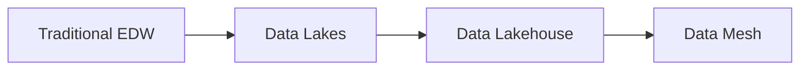
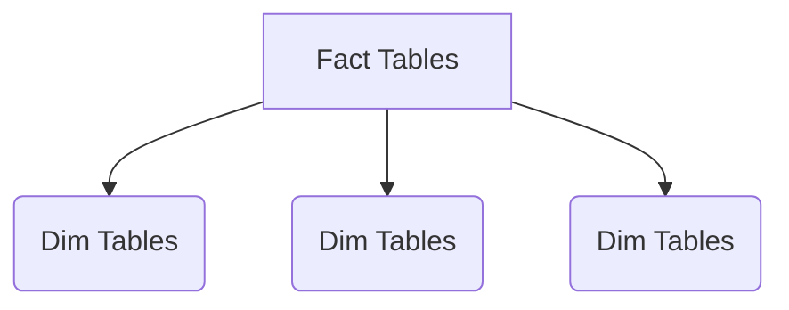

# Data Architecture Fundamentals for Data Engineers

## Table of Contents
1. [Modern Data Architecture Overview](#modern-data-architecture-overview)
2. [Medallion Architecture Deep Dive](#medallion-architecture-deep-dive)
3. [Data Vault Methodology](#data-vault-methodology)
4. [Kimball Dimensional Modeling](#kimball-dimensional-modeling)
5. [Data Lakehouse Architecture](#data-lakehouse-architecture)
6. [Best Practices for Data Architecture](#best-practices-for-data-architecture)
7. [Implementation Patterns](#implementation-patterns)

---

## Modern Data Architecture Overview

### Core Architectural Patterns

| Architecture | Description | Best For |
|--------------|-------------|----------|
| **Medallion** | Layered approach (Bronze→Silver→Gold) | Modern data lakes, Delta Lake |
| **Data Vault** | Hub-Satellite-Link model | EDW, highly regulated industries |
| **Kimball** | Star/Snowflake schemas | Analytical reporting |
| **Lakehouse** | Combines lake + warehouse | Unified analytics |

### Evolution of Data Architectures



---

## Medallion Architecture Deep Dive

### The Three Layers

1. **Bronze Layer (Raw)**
   - Preserves source data exactly
   - Append-only immutable storage
   - Schema applied on read
   - Example: JSON/CSV files with metadata

2. **Silver Layer (Cleaned)**
   - Validated, deduplicated data
   - Type conversions applied
   - Basic business entities formed
   - Example: Parquet/Delta tables with schema

3. **Gold Layer (Business)**
   - Business-ready aggregates
   - Optimized for consumption
   - Dimensional models or wide tables
   - Example: Star schemas, feature stores

### Implementation Example (Databricks)

```python
# Bronze to Silver processing
(spark.read.format("json")
 .load("/bronze/transactions")
 .filter("amount > 0")
 .write.format("delta")
 .save("/silver/transactions"))

# Silver to Gold aggregation
(spark.read.format("delta")
 .load("/silver/transactions")
 .groupBy("customer_id")
 .agg(sum("amount").alias("lifetime_value"))
 .write.format("delta")
 .save("/gold/customer_metrics"))
```

### Best Practices

- **Incremental Processing**: Use CDC patterns in Silver/Gold
- **Schema Evolution**: Use Delta Lake for schema enforcement
- **Data Quality**: Implement Great Expectations or DBT tests
- **Partitioning**: Time-based for Bronze, business keys for Gold

---

## Data Vault Methodology

### Core Components

| Component | Description | Example |
|-----------|-------------|---------|
| **Hubs** | Business keys | Customer_ID |
| **Links** | Relationships | Order_Product |
| **Satellites** | Descriptive attributes | Customer_Demographics |

### Implementation Pattern

```sql
-- Hub Table
CREATE TABLE hub_customer (
    customer_hashkey VARCHAR(32) PRIMARY KEY,
    customer_id VARCHAR(20),
    load_date TIMESTAMP,
    record_source VARCHAR(10)
);

-- Satellite Table
CREATE TABLE sat_customer_details (
    customer_hashkey VARCHAR(32),
    effective_date TIMESTAMP,
    first_name VARCHAR(100),
    last_name VARCHAR(100),
    PRIMARY KEY (customer_hashkey, effective_date)
);
```

### When to Use Data Vault

✔ Highly regulated industries  
✔ Complex source systems  
✔ Historical tracking requirements  
✖ Simple analytics needs  

---

## Kimball Dimensional Modeling

### Star Schema Components



### Implementation Example

```sql
-- Fact Table
CREATE TABLE fact_sales (
    sale_id INT,
    date_key INT REFERENCES dim_date(date_key),
    product_key INT REFERENCES dim_product(product_key),
    customer_key INT REFERENCES dim_customer(customer_key),
    amount DECIMAL(12,2)
);

-- Slowly Changing Dimension (Type 2)
CREATE TABLE dim_customer (
    customer_key INT IDENTITY(1,1) PRIMARY KEY,
    customer_id VARCHAR(20),
    name VARCHAR(100),
    effective_date DATE,
    expiry_date DATE,
    current_flag BOOLEAN
);
```

### Best Practices

- **Conformed Dimensions**: Shared across business areas
- **Surrogate Keys**: System-generated for dimensions
- **Grain Definition**: Clear fact table granularity
- **Aggregations**: Pre-calculate in Gold layer

---

## Data Lakehouse Architecture

### Key Features

1. **ACID Transactions**: Delta Lake/Iceberg formats
2. **Schema Enforcement**: Schema-on-write capability
3. **Multi-Modal Processing**: Batch + streaming unified
4. **Open Standards**: Parquet/JSON/AVRO support

### Reference Architecture

```
┌───────────────────────┐
│       BI Tools        │
└──────────┬────────────┘
┌──────────▼────────────┐
│      SQL Endpoint     │
└──────────┬────────────┘
┌──────────▼────────────┐
│   Gold (Delta Lake)   │
├───────────────────────┤
│   Silver (Delta)      │
├───────────────────────┤
│   Bronze (Files)      │
└──────────┬────────────┘
┌──────────▼────────────┐
│   Ingestion Layer     │
│ (Kafka, Spark, etc.)  │
└───────────────────────┘
```

---

## Best Practices for Data Architecture

### Design Principles

1. **Decouple Storage/Compute**: Cloud object storage + elastic clusters
2. **Data as Product**: Domain-oriented ownership (Data Mesh)
3. **Incremental Processing**: Avoid full reloads where possible
4. **Observability**: Data lineage + quality monitoring

### Performance Optimization

| Technique | Bronze | Silver | Gold |
|-----------|--------|--------|------|
| **File Size** | 100-200MB | 200-500MB | 500MB-1GB |
| **Partitioning** | By load time | By source system | By business key |
| **Compression** | Snappy | Zstandard | Zstandard |
| **Indexing** | None | Bloom filters | Materialized views |

### Security Patterns

- **Bronze**: Read-only for producers
- **Silver**: Transformational access
- **Gold**: Role-based access (RBAC)
- **Data Masking**: PII handling in Silver

---

## Implementation Patterns

### Batch Processing Pipeline

```python
# Sample PySpark pipeline
def process_batch(spark):
    # Bronze: Ingest raw data
    raw_df = (spark.read.format("kafka")
              .option("subscribe", "transactions")
              .load())
    
    # Silver: Clean and validate
    clean_df = (raw_df
               .filter("amount IS NOT NULL")
               .dropDuplicates(["transaction_id"]))
    
    # Gold: Business aggregation
    (clean_df.groupBy("customer_id")
     .agg(sum("amount").alias("ytd_spend"))
     .write.format("delta")
     .mode("overwrite")
     .saveAsTable("gold.customer_spend"))
```

### Streaming Architecture

```
┌─────────────┐   ┌─────────────┐   ┌─────────────┐
│   Kafka    │──▶│ Spark      │──▶│ Delta Lake │
│ (Events)   │   │ Streaming  │   │ (Silver)   │
└─────────────┘   └─────────────┘   └─────────────┘
                                      ▼
                               ┌─────────────┐
                               │  Materialized │
                               │   Views      │
                               └─────────────┘
```

### Hybrid Approach Checklist

- [ ] Implement change data capture (CDC)
- [ ] Schedule batch for backfills
- [ ] Use streaming for real-time metrics
- [ ] Unified checkpointing

---

## Architectural Decision Framework

1. **Requirements Analysis**
   - Latency needs (real-time vs batch)
   - Data volume/velocity
   - Compliance requirements

2. **Pattern Selection**
   ```mermaid
   graph TD
       A[Structured Data?] -->|Yes| B[Kimball]
       A -->|No| C[Medallion]
       B --> D[Regulated?]
       D -->|Yes| E[Data Vault]
       D -->|No| F[Star Schema]
   ```

3. **Tool Evaluation**
   - Storage: S3/ADLS/GCS + Delta/Iceberg
   - Processing: Spark/Flink/Databricks
   - Orchestration: Airflow/Dagster

4. **Implementation Roadmap**
   - Phase 1: Bronze landing
   - Phase 2: Silver transformations
   - Phase 3: Gold consumption layer

---

This comprehensive guide covers the essential architectures with practical implementation patterns. The best approach depends on your specific requirements around data freshness, compliance needs, and analytical use cases.