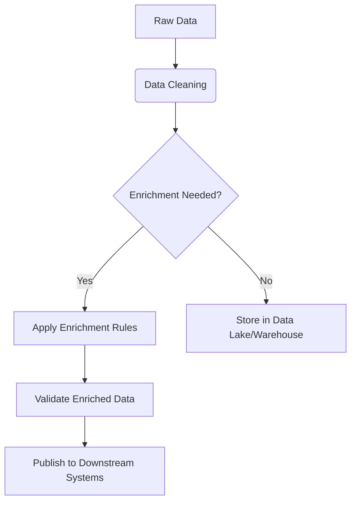

# **Data Engineering: Focus on Data Enrichment**

## **Table of Contents**
1. [Introduction to Data Enrichment](#introduction-to-data-enrichment)  
2. [Why Data Enrichment Matters](#why-data-enrichment-matters)  
3. [Key Techniques for Data Enrichment](#key-techniques-for-data-enrichment)  
4. [Data Enrichment Workflow](#data-enrichment-workflow)  
5. [Tools & Technologies](#tools--technologies)  
6. [Real-World Use Cases](#real-world-use-cases)  
7. [Best Practices](#best-practices)  
8. [Challenges & Solutions](#challenges--solutions)  
9. [Advanced Enrichment Strategies](#advanced-enrichment-strategies)  
10. [Conclusion](#conclusion)  

---

## **1. Introduction to Data Enrichment**
Data enrichment is the process of enhancing raw data by adding context, improving accuracy, and filling gaps using internal or external sources.  

### **What It Involves:**
- **Appending missing data** (e.g., adding geolocation from IP addresses)  
- **Standardizing formats** (e.g., converting phone numbers to E.164)  
- **Enhancing with external datasets** (e.g., weather data for retail analytics)  
- **Deriving new attributes** (e.g., sentiment analysis on customer reviews)  

### **Example:**
| Raw Data | Enriched Data |
|----------|--------------|
| `{ "user_id": 101, "city": "NY" }` | `{ "user_id": 101, "city": "New York", "timezone": "EST", "population": 8.4M }` |

---

## **2. Why Data Enrichment Matters**
✅ **Improves Decision-Making** (better analytics, AI/ML models)  
✅ **Enhances Customer Insights** (personalization, segmentation)  
✅ **Reduces Data Silos** (unifies multiple sources)  
✅ **Boosts Data Quality** (fixes inconsistencies, missing values)  

### **Business Impact:**
- **Marketing:** Better targeting with demographic enrichment  
- **Finance:** Fraud detection with transaction enrichment  
- **Operations:** Supply chain optimization with weather/environmental data  

---

## **3. Key Techniques for Data Enrichment**
### **A. Basic Enrichment**
| Technique | Example |
|-----------|---------|
| **Geocoding** | `"San Fran"` → `{ "city": "San Francisco", "lat": 37.7749, "lng": -122.4194 }` |
| **Demographic Append** | `{ "user_id": 101 }` → `{ "income_bracket": "$50k-$75k" }` |
| **Time Zone Conversion** | `"2024-01-01T12:00:00"` → `"2024-01-01T15:00:00 UTC"` |

### **B. Advanced Enrichment**
| Technique | Example |
|-----------|---------|
| **Sentiment Analysis** | `"This product is amazing!"` → `{ "sentiment_score": 0.9 }` |
| **Entity Resolution** | `"Apple Inc."` + `"AAPL"` → `{ "company_id": "C001", "ticker": "AAPL" }` |
| **Graph-Based Linking** | `User A → Purchased → Product X` → `"Also bought: Product Y, Z"` |

---

## **4. Data Enrichment Workflow**
### **Step-by-Step Process**


### **Example: Enriching Customer Data**
1. **Input:** `{ "email": "user@example.com", "ip": "192.168.1.1" }`  
2. **Cleaning:** Validate email format, check IP validity  
3. **Enrichment:**  
   - Append company info from email domain (`"example.com" → "Example Corp"`)  
   - Add location from IP (`"192.168.1.1" → "New York, USA"`)  
4. **Output:**  
   ```json
   {
     "email": "user@example.com",
     "company": "Example Corp",
     "location": { "city": "New York", "country": "USA" }
   }
   ```

---

## **5. Tools & Technologies**
### **A. Open-Source Tools**
| Tool | Purpose |
|------|---------|
| **Apache Spark** | Large-scale data processing |
| **Python (Pandas, Faker)** | Small-scale enrichment |
| **OpenRefine** | Data cleaning + standardization |
| **PostgreSQL (PostGIS)** | Geospatial enrichment |

### **B. Commercial Solutions**
| Tool | Use Case |
|------|---------|
| **Google Cloud DLP** | PII detection & masking |
| **Clearbit** | B2B company data enrichment |
| **Talend** | ETL + data quality |
| **Snowflake (External Functions)** | Enrichment via APIs |

---

## **6. Real-World Use Cases**
### **A. E-Commerce Personalization**
- **Problem:** Anonymous visitors provide little data  
- **Solution:**  
  - Enrich with device/browser data → `"Mobile, iOS, Chrome"`  
  - Append location → `"London, UK"`  
  - Recommend local currency & products  

### **B. Fraud Detection in Banking**
- **Problem:** Need to verify transaction legitimacy  
- **Solution:**  
  - Enrich with:  
    - IP geolocation (`"Login from Nigeria?"`)  
    - Device fingerprinting (`"New device detected"`)  
    - Historical behavior (`"Unusual spending pattern"`)  

---

## **7. Best Practices**
✅ **Start Small** (enrich 1-2 key fields first)  
✅ **Use Idempotent Operations** (avoid duplicate enrichments)  
✅ **Monitor Data Quality** (validate outputs)  
✅ **Cache External API Calls** (reduce costs & latency)  

### **Example: Caching Enrichments**
```python
import redis
import requests

cache = redis.Redis()

def enrich_company(domain):
    cached_data = cache.get(f"company:{domain}")
    if cached_data:
        return cached_data
    else:
        data = requests.get(f"https://api.clearbit.com/domains/{domain}").json()
        cache.setex(f"company:{domain}", 86400, data)  # Cache for 24h
        return data
```

---

## **8. Challenges & Solutions**
| Challenge | Solution |
|-----------|----------|
| **High API Costs** | Batch requests, use caching |
| **Slow Performance** | Parallel processing (Spark, Dask) |
| **Data Privacy Risks** | Anonymize before enrichment |
| **Schema Conflicts** | Use schema evolution (Avro, Delta Lake) |

---

## **9. Advanced Enrichment Strategies**
### **A. Machine Learning-Powered Enrichment**
- **Predictive Enrichment:**  
  - `"User clicked X"` → `"Likely to buy Y (85% confidence)"`  
- **Fuzzy Matching:**  
  - `"McDonalds"` ≈ `"Mcdonald's"` → `"Same entity"`  

### **B. Real-Time Streaming Enrichment**
```python
# Kafka + Spark Streaming Example
df = spark.readStream.format("kafka")...
enriched_df = df.withColumn("location", call_geo_api(col("ip")))
enriched_df.writeStream.format("delta").start()
```

---

## **10. Conclusion**
Data enrichment turns raw data into **actionable insights**. Key takeaways:
- Start with **basic cleaning & standardization**  
- Use **APIs, ML, and external datasets** for deeper enrichment  
- Optimize for **cost, speed, and accuracy**  
- **Monitor & validate** enriched data  

### **Next Steps:**
1. Implement a **small enrichment pipeline** (e.g., geocoding)  
2. Experiment with **open datasets** (e.g., OpenStreetMap)  
3. Explore **real-time vs. batch enrichment** tradeoffs  

---
**🚀 Now you’re ready to supercharge your data!**