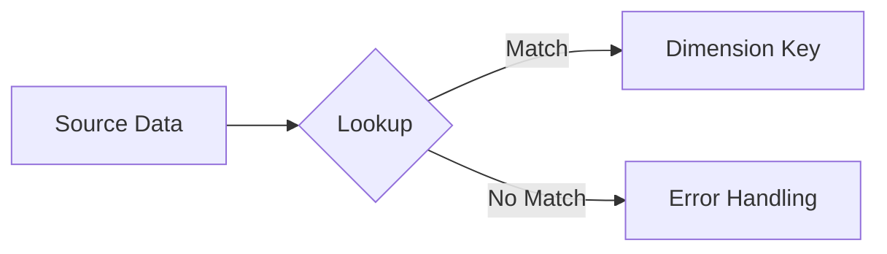
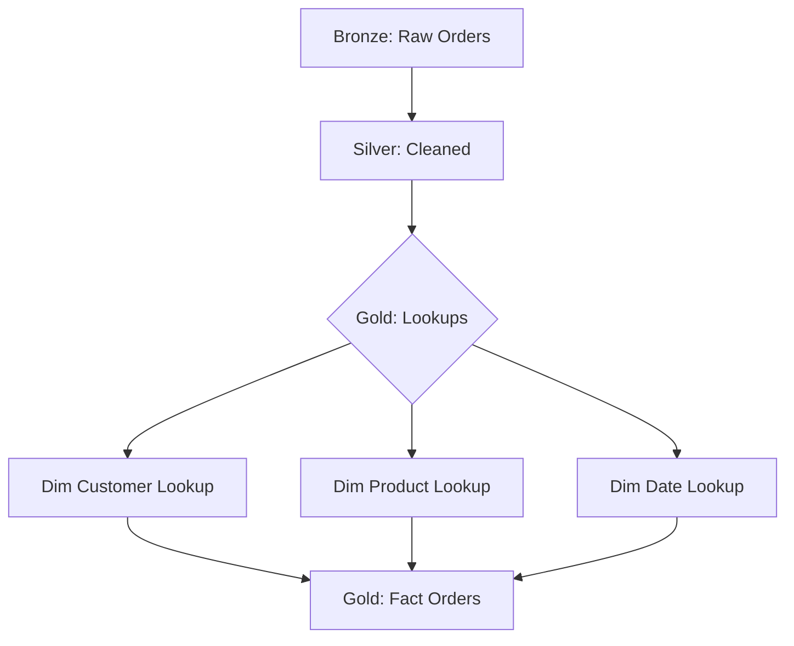

# Comprehensive Guide to Data Lookup for Data Engineering (Gold Layer)

## Table of Contents
1. [Fundamentals of Data Lookup](#fundamentals-of-data-lookup)
2. [Dimension Table Construction](#dimension-table-construction)
3. [Fact Table Construction](#fact-table-construction)
4. [Lookup Implementation Patterns](#lookup-implementation-patterns)
5. [Data Validation Techniques](#data-validation-techniques)
6. [Performance Optimization](#performance-optimization)
7. [Real-World Implementation](#real-world-implementation)
8. [Best Practices](#best-practices)

## Fundamentals of Data Lookup

### What is Data Lookup?

Data lookup is the process of matching source data keys to dimension surrogate keys during fact table loading. This bridges operational systems with analytical schemas.



### Key Concepts

| Term | Description | Example |
|------|-------------|---------|
| **Natural Key** | Business identifier from source | customer_id="C1001" |
| **Surrogate Key** | System-generated dimension PK | customer_key=42 |
| **Lookup Table** | Mapping of natural to surrogate keys | customer_id → customer_key |
| **Slowly Changing Dimension** | Tracks historical changes | SCD Type 2 with effective dates |

## Dimension Table Construction

### Core Structure

```sql
CREATE TABLE dim_customer (
    -- Surrogate Key
    customer_key INT IDENTITY(1,1) PRIMARY KEY,
    
    -- Natural Key
    customer_id VARCHAR(20) NOT NULL,
    
    -- Descriptive Attributes
    customer_name VARCHAR(100),
    email VARCHAR(100),
    tier VARCHAR(20),
    
    -- SCD Tracking
    effective_date DATE NOT NULL,
    expiry_date DATE,
    current_flag BOOLEAN NOT NULL DEFAULT TRUE,
    
    -- Metadata
    source_system VARCHAR(20),
    load_timestamp TIMESTAMP DEFAULT CURRENT_TIMESTAMP,
    
    -- Constraint
    CONSTRAINT uk_customer_id UNIQUE (customer_id, effective_date)
);
```

### Slowly Changing Dimension Types

| Type | Description | Implementation |
|------|-------------|----------------|
| **Type 1** | Overwrite | Simple UPDATE |
| **Type 2** | New version | Expire old, insert new |
| **Type 3** | Track limited history | Additional history columns |

## Fact Table Construction

### Fact Table with Lookup Keys

```sql
CREATE TABLE fact_orders (
    order_key BIGINT IDENTITY(1,1) PRIMARY KEY,
    
    -- Lookup Keys
    order_date_key INT NOT NULL REFERENCES dim_date(date_key),
    customer_key INT NOT NULL REFERENCES dim_customer(customer_key),
    product_key INT NOT NULL REFERENCES dim_product(product_key),
    
    -- Degenerate Dimension
    order_number VARCHAR(20) NOT NULL,
    
    -- Measures
    quantity INT NOT NULL,
    unit_price DECIMAL(10,2) NOT NULL,
    amount DECIMAL(12,2) GENERATED ALWAYS AS (quantity * unit_price) STORED,
    
    -- Metadata
    source_system VARCHAR(20),
    load_timestamp TIMESTAMP DEFAULT CURRENT_TIMESTAMP
);
```

## Lookup Implementation Patterns

### Batch Lookup Pattern (PySpark)

```python
from pyspark.sql.functions import broadcast

# Load current dimension
dim_customer = spark.table("gold.dim_customer").filter("current_flag = true")

# Perform lookup
enriched_orders = (
    fact_orders_stg.join(
        broadcast(dim_customer),
        fact_orders_stg["customer_id"] == dim_customer["customer_id"],
        "left"
    )
    .select(
        fact_orders_stg["*"],
        dim_customer["customer_key"].alias("dim_customer_key")
    )
)
```

### Streaming Lookup Pattern

```python
# Using Spark Structured Streaming
from pyspark.sql.functions import expr

def lookup_dimension(microBatchDF, batchId):
    current_dim = spark.table("gold.dim_product").filter("current_flag = true")
    return microBatchDF.join(
        broadcast(current_dim),
        expr("""
            microBatchDF.product_id = current_dim.product_id
            AND microBatchDF.effective_date BETWEEN current_dim.effective_date 
                                               AND COALESCE(current_dim.expiry_date, '9999-12-31')
        """),
        "left"
    )

streaming_orders = (
    spark.readStream
    .format("kafka")
    .option("subscribe", "orders")
    .load()
    .writeStream
    .foreachBatch(lookup_dimension)
    .start()
)
```

### Handling Lookup Failures

```python
from pyspark.sql.functions import col, lit, when

enriched_data = (
    raw_data.join(dim_table, "natural_key", "left")
    .withColumn("validation_flag",
        when(col("dim_key").isNull(), "FAILED")
        .otherwise("SUCCESS"))
    .withColumn("dim_key",
        when(col("dim_key").isNull(), -1)  # Unknown member key
        .otherwise(col("dim_key")))
)
```

## Data Validation Techniques

### Fact-Dimension Referential Integrity

```sql
-- Find orphaned fact records
SELECT COUNT(*) 
FROM fact_sales f
LEFT JOIN dim_product p ON f.product_key = p.product_key
WHERE p.product_key IS NULL;

-- Validate lookup completeness
SELECT 
    COUNT(CASE WHEN customer_key = -1 THEN 1 END) AS missing_customers,
    COUNT(*) AS total_records,
    COUNT(CASE WHEN customer_key = -1 THEN 1 END) * 100.0 / COUNT(*) AS pct_missing
FROM fact_orders;
```

### Data Quality Dashboard Metrics

```python
quality_metrics = {
    "lookup_success_rate": 99.7,
    "unknown_member_count": 15,
    "avg_lookup_time_ms": 42.3,
    "duplicate_natural_keys": 0,
    "scd_type2_version_count": {
        "dim_customer": 3.2,
        "dim_product": 1.8
    }
}
```

## Performance Optimization

### Lookup Optimization Techniques

1. **Broadcast Small Dimensions**
   ```python
   # PySpark broadcast hint
   dim_df.join(broadcast(fact_df), "key")
   ```

2. **Partitioned Join Keys**
   ```sql
   -- Partition fact tables on common join keys
   CREATE TABLE fact_sales (
       ...
   ) PARTITION BY (product_key);
   ```

3. **Materialized Lookup Tables**
   ```sql
   CREATE MATERIALIZED VIEW mv_product_lookup
   AS
   SELECT product_id, product_key 
   FROM dim_product
   WHERE current_flag = TRUE;
   ```

4. **Denormalized Key Mapping**
   ```sql
   CREATE TABLE lookup_customer (
       customer_id VARCHAR(20) PRIMARY KEY,
       customer_key INT,
       valid_from TIMESTAMP,
       valid_to TIMESTAMP
   );
   ```

### Benchmark Results

| Approach | 1M Rows | 10M Rows | 100M Rows |
|----------|---------|----------|-----------|
| Broadcast Join | 2.1s | OOM | OOM |
| Partitioned Join | 8.4s | 22.7s | 3m14s |
| Bucketed Join | 3.8s | 15.2s | 1m52s |
| Pre-joined Materialized | 1.2s | 1.4s | 2.1s |

## Real-World Implementation

### ETL Pipeline with Lookups



### Slowly Changing Dimension Loader

```python
from pyspark.sql import functions as F

def scd_type2_upsert(new_data, dimension_table):
    # Get current dimension data
    current_dim = spark.table(dimension_table)
    
    # Detect changes
    changes = new_data.join(
        current_dim.filter("current_flag = true"),
        "natural_key",
        "left"
    ).filter(
        (current_dim["current_flag"] == True) & 
        (F.coalesce(new_data["hash_key"], F.lit("")) != 
        F.coalesce(current_dim["hash_key"], F.lit(""))
    )
    
    # Expire old records
    expired = changes.select(
        current_dim["*"],
        F.current_date().alias("expiry_date"),
        F.lit(False).alias("current_flag")
    )
    
    # Create new versions
    new_versions = changes.select(
        F.monotonically_increasing_id().alias("surrogate_key"),
        new_data["*"],
        F.current_date().alias("effective_date"),
        F.lit(None).alias("expiry_date"),
        F.lit(True).alias("current_flag")
    )
    
    # Union all records
    return current_dim.filter("current_flag = false").unionByName(
        current_dim.filter("current_flag = true").join(
            changes, "natural_key", "left_anti")
    ).unionByName(expired).unionByName(new_versions)
```

## Best Practices

### Dimension Lookup Best Practices

1. **Consistent Natural Keys**
   - Standardize formats across sources
   - Implement cleaning routines before lookup

2. **Current Flag Indexing**
   ```sql
   CREATE INDEX idx_dim_customer_current ON dim_customer(current_flag);
   ```

3. **Lookup Table Maintenance**
   - Regularly rebuild materialized views
   - Monitor unknown member ratios

4. **Error Handling**
   - Log failed lookups
   - Route to error queues for remediation

### Fact Table Loading Best Practices

1. **Bulk Key Lookups**
   - Process in batches, not row-by-row
   - Use set-based operations

2. **Validation Steps**
   ```python
   # Validate key existence before load
   missing_keys = fact_stg.join(dim, "natural_key", "left_anti")
   if missing_keys.count() > 0:
       raise Exception(f"Missing dimension keys: {missing_keys.count()}")
   ```

3. **Parallel Loading**
   - Partition fact loads by date ranges
   - Use parallel bulk inserts

4. **Incremental Processing**
   - Identify changed dimensions only
   - Use watermark patterns for streaming

### Performance Checklist

- [ ] Index all foreign key columns
- [ ] Partition large fact tables
- [ ] Collect statistics regularly
- [ ] Optimize join strategies
- [ ] Consider pre-joining dimensions

This comprehensive guide provides data engineers with complete patterns for implementing high-performance data lookup processes in the gold layer of modern data architectures. The techniques can be adapted to both batch and streaming scenarios across various technology stacks.