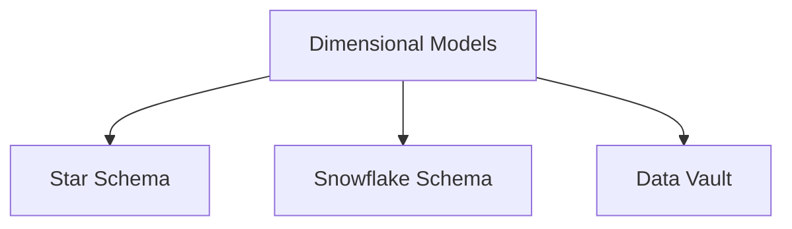
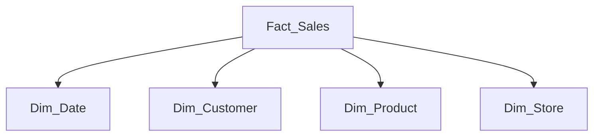
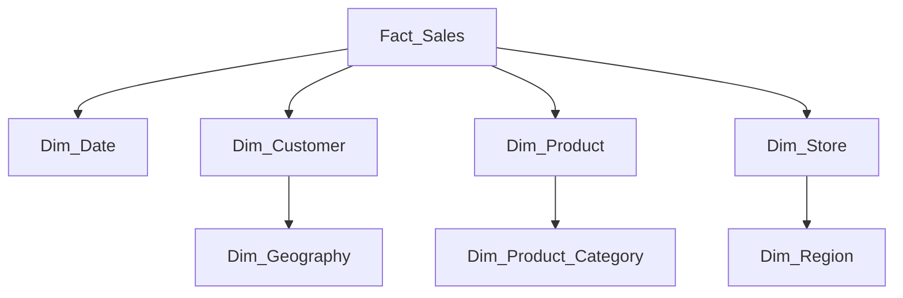
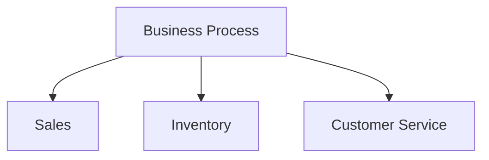
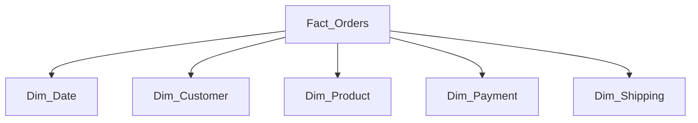
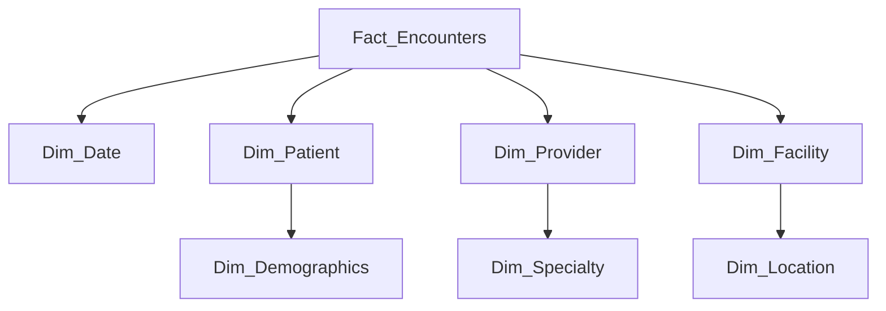

# Data Modeling for Data Engineers: Star Schema vs Snowflake

## Table of Contents
1. [Introduction to Dimensional Modeling](#introduction-to-dimensional-modeling)
2. [Star Schema Deep Dive](#star-schema-deep-dive)
3. [Snowflake Schema Explained](#snowflake-schema-explained)
4. [Comparison of Approaches](#comparison-of-approaches)
5. [Implementation Guide](#implementation-guide)
6. [Optimization Techniques](#optimization-techniques)
7. [Real-World Examples](#real-world-examples)
8. [Best Practices](#best-practices)

## Introduction to Dimensional Modeling

### Core Concepts

**Dimensional modeling** is a data warehouse design technique that organizes data into fact and dimension tables for optimized analytical querying.



### Key Components

| Component | Description | Example |
|-----------|-------------|---------|
| **Fact Tables** | Contain business metrics/measurements | sales_amount, order_quantity |
| **Dimension Tables** | Descriptive context for facts | date, customer, product |
| **Surrogate Keys** | System-generated identifiers | customer_sk, product_sk |
| **Natural Keys** | Business identifiers | customer_id, product_code |

## Star Schema Deep Dive

### Structure Overview



### Implementation Example

```sql
-- Fact Table
CREATE TABLE fact_sales (
    sale_id INT IDENTITY(1,1),
    date_key INT NOT NULL,
    customer_key INT NOT NULL,
    product_key INT NOT NULL,
    store_key INT NOT NULL,
    quantity INT,
    amount DECIMAL(12,2),
    CONSTRAINT pk_fact_sales PRIMARY KEY (sale_id),
    CONSTRAINT fk_date FOREIGN KEY (date_key) REFERENCES dim_date(date_key),
    CONSTRAINT fk_customer FOREIGN KEY (customer_key) REFERENCES dim_customer(customer_key)
);

-- Dimension Table (Date)
CREATE TABLE dim_date (
    date_key INT PRIMARY KEY,
    full_date DATE NOT NULL,
    day_number INT,
    month_number INT,
    year INT,
    quarter INT,
    day_of_week VARCHAR(10),
    is_weekend BIT,
    is_holiday BIT
);
```

### Characteristics

- **Denormalized** dimensions (all attributes in one table)
- **Simpler queries** with fewer joins
- **Faster query performance** for analytics
- **Less flexible** to changes in hierarchies

## Snowflake Schema Explained

### Structure Overview



### Implementation Example

```sql
-- Normalized Product Dimension
CREATE TABLE dim_product (
    product_key INT PRIMARY KEY,
    product_id VARCHAR(20) NOT NULL,
    product_name VARCHAR(100),
    category_key INT,
    supplier_key INT,
    price DECIMAL(10,2),
    CONSTRAINT fk_category FOREIGN KEY (category_key) REFERENCES dim_product_category(category_key)
);

CREATE TABLE dim_product_category (
    category_key INT PRIMARY KEY,
    category_name VARCHAR(50),
    department_key INT,
    CONSTRAINT fk_department FOREIGN KEY (department_key) REFERENCES dim_department(department_key)
);
```

### Characteristics

- **Normalized** dimensions (split into multiple tables)
- **More complex queries** with additional joins
- **Better storage efficiency** (less redundancy)
- **More flexible** to hierarchical changes

## Comparison of Approaches

| Feature | Star Schema | Snowflake Schema |
|---------|------------|------------------|
| **Query Performance** | Faster (fewer joins) | Slower (more joins) |
| **Storage Efficiency** | Less efficient | More efficient |
| **ETL Complexity** | Simpler | More complex |
| **Flexibility** | Less flexible | More flexible |
| **Maintenance** | Easier | Harder |
| **Typical Use Case** | Business intelligence | Complex hierarchies |

## Implementation Guide

### Step 1: Identify Business Processes



### Step 2: Define Grain (Level of Detail)

```sql
-- Example grain statements:
-- "One row per retail sale transaction line item"
-- "Daily snapshot of inventory levels by product"
```

### Step 3: Identify Dimensions

**Retail Sales Example:**
- Date
- Product
- Store
- Customer
- Promotion

### Step 4: Identify Facts

```sql
-- Quantitative metrics:
-- sales_amount, quantity_sold, discount_amount
```

### Step 5: Build Dimension Tables

**Customer Dimension Best Practices:**

```sql
CREATE TABLE dim_customer (
    customer_key INT IDENTITY(1,1) PRIMARY KEY,
    customer_id VARCHAR(20) NOT NULL, -- Natural key
    customer_name VARCHAR(100),
    email VARCHAR(100),
    phone VARCHAR(20),
    address VARCHAR(200),
    city VARCHAR(50),
    state VARCHAR(30),
    postal_code VARCHAR(20),
    country VARCHAR(50),
    -- SCD Type 2 columns
    effective_date DATE,
    expiry_date DATE,
    current_flag BOOLEAN,
    -- Metadata
    source_system VARCHAR(20),
    create_timestamp TIMESTAMP DEFAULT CURRENT_TIMESTAMP
);
```

### Step 6: Build Fact Tables

```sql
CREATE TABLE fact_sales (
    sale_key BIGINT IDENTITY(1,1) PRIMARY KEY,
    date_key INT REFERENCES dim_date(date_key),
    product_key INT REFERENCES dim_product(product_key),
    customer_key INT REFERENCES dim_customer(customer_key),
    store_key INT REFERENCES dim_store(store_key),
    promotion_key INT REFERENCES dim_promotion(promotion_key),
    -- Measures
    quantity INT,
    unit_price DECIMAL(10,2),
    sales_amount DECIMAL(12,2),
    discount_amount DECIMAL(10,2),
    net_amount DECIMAL(12,2),
    -- Degenerate dimension
    transaction_id VARCHAR(20),
    -- Metadata
    source_system VARCHAR(20),
    create_timestamp TIMESTAMP DEFAULT CURRENT_TIMESTAMP
);
```

## Optimization Techniques

### Indexing Strategies

```sql
-- Fact table indexes
CREATE INDEX idx_fact_sales_date ON fact_sales(date_key);
CREATE INDEX idx_fact_sales_product ON fact_sales(product_key);
CREATE INDEX idx_fact_sales_customer ON fact_sales(customer_key);

-- Dimension table indexes
CREATE INDEX idx_dim_product_id ON dim_product(product_id);
CREATE INDEX idx_dim_customer_id ON dim_customer(customer_id);
```

### Partitioning Large Fact Tables

```sql
-- PostgreSQL example
CREATE TABLE fact_sales (
    ...
) PARTITION BY RANGE (date_key);

-- Create monthly partitions
CREATE TABLE fact_sales_202301 PARTITION OF fact_sales
    FOR VALUES FROM (20230101) TO (20230201);
```

### Materialized Views for Aggregates

```sql
CREATE MATERIALIZED VIEW mv_monthly_sales
REFRESH COMPLETE ON DEMAND
AS
SELECT 
    d.year,
    d.month,
    p.category,
    SUM(f.sales_amount) AS total_sales,
    COUNT(*) AS transaction_count
FROM fact_sales f
JOIN dim_date d ON f.date_key = d.date_key
JOIN dim_product p ON f.product_key = p.product_key
GROUP BY d.year, d.month, p.category;
```

## Real-World Examples

### E-Commerce Star Schema



**Fact Table Columns:**
- order_id (degenerate dimension)
- customer_key
- product_key
- date_key
- payment_key
- shipping_key
- quantity
- unit_price
- discount_amount
- tax_amount
- shipping_cost
- total_amount

### Healthcare Snowflake Schema



## Best Practices

### Design Principles

1. **Always Use Surrogate Keys**
   - System-generated integers (IDENTITY/SEQUENCE)
   - Independent of source systems

2. **Implement Slowly Changing Dimensions (SCD)**
   ```sql
   -- Type 2 SCD pattern
   UPDATE dim_customer
   SET current_flag = FALSE, expiry_date = CURRENT_DATE - 1
   WHERE customer_id = 'C1001' AND current_flag = TRUE;
   
   INSERT INTO dim_customer (...)
   VALUES ('C1001', 'New Name', ..., CURRENT_DATE, NULL, TRUE);
   ```

3. **Conformed Dimensions Across Facts**
   - Same customer dimension for sales and service facts

4. **Optimize Fact Table Design**
   - Narrow columns (INT vs BIGINT when possible)
   - Avoid NULLs in fact measures (use 0 instead)

### ETL Considerations

**Dimension Loading Pattern:**

```python
# PySpark example for SCD Type 2
from pyspark.sql import functions as F

# Get existing dimension data
existing_dim = spark.table("dim_customer")

# Identify changes
changes = new_data.join(existing_dim, "customer_id", "left_outer") \
    .filter((existing_dim["current_flag"] == True) & 
           ((new_data["name"] != existing_dim["name"]) | 
            (new_data["email"] != existing_dim["email"])))

# Expire old records
updates = changes.select(
    existing_dim["customer_key"],
    F.lit(False).alias("current_flag"),
    F.current_date().alias("expiry_date")
)

# Insert new versions
inserts = changes.select(
    F.monotonically_increasing_id().alias("customer_key"),
    changes["customer_id"],
    changes["name"],
    changes["email"],
    F.current_date().alias("effective_date"),
    F.lit(None).alias("expiry_date"),
    F.lit(True).alias("current_flag")
)

# Write changes
updates.write.mode("append").saveAsTable("dim_customer")
inserts.write.mode("append").saveAsTable("dim_customer")
```

### Query Optimization Tips

1. **Star Join Optimization**
   ```sql
   -- Enable star join optimization in Spark
   SET spark.sql.cbo.enabled=true;
   SET spark.sql.cbo.joinReorder.enabled=true;
   ```

2. **Partition Pruning**
   ```sql
   -- Ensure queries filter on partition columns
   SELECT * FROM fact_sales 
   WHERE date_key BETWEEN 20230101 AND 20230131;
   ```

3. **Aggregate Awareness**
   ```sql
   -- Query materialized aggregates when possible
   SELECT * FROM mv_monthly_sales
   WHERE year = 2023 AND month = 1;
   ```

This comprehensive guide provides data engineers with everything needed to implement and optimize star and snowflake schemas in analytical systems. The patterns can be adapted to any SQL or big data environment.