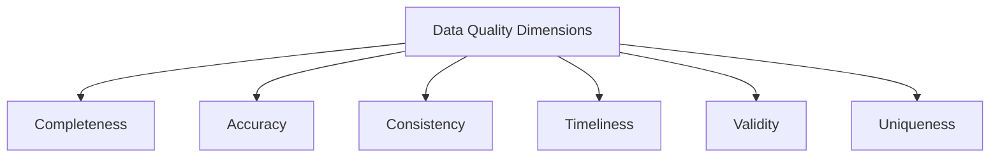
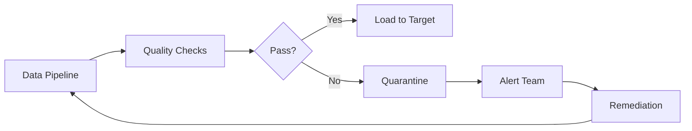

# Data Quality Checklist for Data Engineers

## Comprehensive Data Quality Framework



## 1. Completeness Checks

### Checklist Items:
✅ **Required fields are populated**  
✅ **No unexpected NULL values**  
✅ **All expected records are present**  

### Implementation Examples:

#### Scenario: User Signup Data
```python
# PySpark example
from pyspark.sql.functions import col, count, when

completeness_report = df.select(
    count(when(col("user_id").isNull(), True)).alias("missing_user_ids"),
    count(when(col("signup_date").isNull(), True)).alias("missing_dates"),
    (count("*") - expected_count).alias("missing_records")
).collect()
```

#### Common Data Engineer Issue:
- **Problem**: Daily batch job only loaded 80% of expected records  
- **Root Cause**: Source system API pagination error  
- **Fix**: Implement record count validation in ingestion pipeline

## 2. Accuracy Validation

### Checklist Items:
✅ **Data matches source system**  
✅ **Numerical values within expected ranges**  
✅ **Text fields follow business rules**  

### Implementation Examples:

#### Scenario: Financial Transactions
```sql
-- BigQuery example
SELECT
  COUNTIF(amount < 0) AS negative_amounts,
  COUNTIF(amount > 1000000) AS outlier_transactions,
  COUNTIF(REGEXP_CONTAINS(description, r'[^\x00-\x7F]')) AS non_ascii_descriptions
FROM transactions
```

#### Common Data Engineer Issue:
- **Problem**: Product prices showing as 100x actual value  
- **Root Cause**: Decimal place misinterpretation during CSV import  
- **Fix**: Explicit schema definition with decimal(18,2) type

## 3. Consistency Checks

### Checklist Items:
✅ **Cross-system data matches**  
✅ **Historical trends are stable**  
✅ **Derived values match calculations**  

### Implementation Examples:

#### Scenario: Customer Data Reconciliation
```python
# Data reconciliation between systems
crm_count = spark.sql("SELECT COUNT(*) FROM crm.customers").collect()[0][0]
erp_count = spark.sql("SELECT COUNT(*) FROM erp.customer_master").collect()[0][0]

if abs(crm_count - erp_count) > threshold:
    alert_data_team()
```

#### Common Data Engineer Issue:
- **Problem**: CRM shows 500 more customers than billing system  
- **Root Cause**: Soft-deleted records not synced properly  
- **Fix**: Implement tombstone pattern in CDC pipeline

## 4. Timeliness Verification

### Checklist Items:
✅ **Data arrives within SLA**  
✅ **Processing completes on schedule**  
✅ **Freshness meets business requirements**  

### Implementation Examples:

#### Scenario: IoT Device Data
```python
# Airflow sensor example
from airflow.sensors.sql import SqlSensor

check_freshness = SqlSensor(
    task_id="check_data_freshness",
    conn_id="data_warehouse",
    sql="SELECT MAX(event_time) > TIMESTAMP_SUB(CURRENT_TIMESTAMP(), INTERVAL 1 HOUR) FROM iot_events",
    timeout=300
)
```

#### Common Data Engineer Issue:
- **Problem**: Nightly batch job misses 6AM SLA  
- **Root Cause**: Resource contention with other jobs  
- **Fix**: Implement priority queues in orchestration

## 5. Validity Testing

### Checklist Items:
✅ **Data conforms to schema**  
✅ **Values in allowed domains**  
✅ **Business rules are enforced**  

### Implementation Examples:

#### Scenario: Healthcare Data
```python
# Great Expectations example
validator.expect_column_values_to_match_regex(
    column="patient_id",
    regex=r"^[A-Z]{3}\d{5}$"
)

validator.expect_column_values_to_be_in_set(
    column="blood_type",
    value_set=["A+", "A-", "B+", "B-", "AB+", "AB-", "O+", "O-"]
)
```

#### Common Data Engineer Issue:
- **Problem**: Invalid dates like "2023-02-30" in database  
- **Root Cause**: Text field without validation  
- **Fix**: Add CAST(date_col AS DATE) with error handling

## 6. Uniqueness Verification

### Checklist Items:
✅ **No duplicate primary keys**  
✅ **Expected duplicates are valid**  
✅ **Cross-source entity resolution works**  

### Implementation Examples:

#### Scenario: E-Commerce Orders
```sql
-- Snowflake duplicate detection
SELECT order_id, COUNT(*) 
FROM orders 
GROUP BY order_id 
HAVING COUNT(*) > 1;
```

#### Common Data Engineer Issue:
- **Problem**: 5% duplicate orders after migration  
- **Root Cause**: UUID collision in legacy system  
- **Fix**: Implement composite key with source_system + legacy_id

## 7. Data Lineage & Provenance

### Checklist Items:
✅ **Source system is documented**  
✅ **Transformation history is tracked**  
✅ **Ownership is clearly assigned**  

### Implementation Examples:

#### Scenario: Data Lake Metadata
```python
# Databricks notebook example
spark.sql("""
  CREATE TABLE silver.customers
  COMMENT 'Cleaned customer data from CRM system'
  TBLPROPERTIES (
    'source_system' = 'Salesforce',
    'ingestion_date' = '2023-12-01',
    'owner' = 'data-engineering-team@company.com'
  )
""")
```

#### Common Data Engineer Issue:
- **Problem**: Can't determine origin of customer segment field  
- **Root Cause**: Missing lineage documentation  
- **Fix**: Implement data catalog with column-level lineage

## 8. Statistical Quality Metrics

### Checklist Items:
✅ **Distributions match expectations**  
✅ **Statistical process control in place**  
✅ **Anomalies are detected**  

### Implementation Examples:

#### Scenario: Retail Sales Data
```python
# Statistical process control
from pyspark.sql.functions import stddev, mean, col

stats = df.select(
    mean(col("order_amount")).alias("mean"),
    stddev(col("order_amount")).alias("stddev")
).collect()[0]

anomalies = df.filter(
    abs(col("order_amount") - stats["mean"]) > 3 * stats["stddev"]
)
```

#### Common Data Engineer Issue:
- **Problem**: Average order value suddenly drops by 40%  
- **Root Cause**: New fraud rules filtering valid orders  
- **Fix**: Implement automated statistical alerts

## Data Quality SLA Template

| Metric | Threshold | Measurement Frequency | Owner |
|--------|-----------|-----------------------|-------|
| Record completeness | ≥99.9% | Per batch | Data Eng |
| Value accuracy | ≤0.1% errors | Weekly sampling | Data QA |
| Processing timeliness | ≤15 min delay | Per pipeline run | DevOps |
| Schema validity | 100% compliance | On schema change | Data Arch |

## Automated Quality Monitoring Architecture



## Incident Response Playbook

1. **Detection**: Automated alert triggers
2. **Triage**: Determine impact level
3. **Containment**: Stop affected pipelines
4. **Diagnosis**: Root cause analysis
5. **Remediation**: Data correction
6. **Prevention**: Update checks/monitoring

## Data Quality Dashboard Metrics

```python
# Sample metrics to track
quality_metrics = {
    "daily_record_completeness": 99.97,
    "value_accuracy_rate": 99.82,
    "pipeline_success_rate": 98.4,
    "schema_violations": 12,
    "mean_time_to_detect": "2.3h",
    "mean_time_to_resolve": "5.7h"
}
```

This comprehensive checklist covers the critical data quality dimensions that data engineers encounter daily, with practical implementation examples and real-world scenarios. The framework enables systematic quality assurance throughout the data lifecycle.