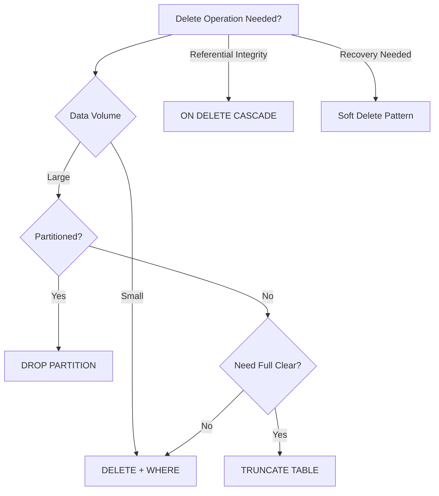

In data engineering, **deletion operations** are critical for managing data lifecycle. Here's a breakdown of key deletion methods with SQL examples:

---

### 🗑️ 1. **`TRUNCATE`**  
Removes all rows from a table *without logging individual row deletions*. Fastest way to clear a table.  
```sql
TRUNCATE TABLE sales_staging; -- Resets identity columns
```

---

### ⛓️ 2. **`CASCADE DELETE`**  
Automatically deletes dependent records in child tables via foreign keys.  
```sql
-- Step 1: Create tables with CASCADE constraint
CREATE TABLE orders (
    order_id INT PRIMARY KEY
);

CREATE TABLE order_items (
    item_id INT PRIMARY KEY,
    order_id INT REFERENCES orders(order_id) 
        ON DELETE CASCADE -- Critical line!
);

-- Step 2: Deleting an order removes its items
DELETE FROM orders WHERE order_id = 1001;
```

---

### 🎯 3. **Standard `DELETE`**  
Removes specific rows with filtering. Logged operation (slower for large datasets).  
```sql
DELETE FROM customers 
WHERE status = 'inactive' 
  AND last_activity_date < '2023-01-01';
```

---

### 🧹 4. **Partition-Based Deletion**  
Efficiently drops entire data partitions (e.g., by date).  
```sql
-- For partitioned tables:
ALTER TABLE sales_data 
DROP PARTITION sales_q1_2023; -- Immediate metadata operation
```

---

### 💥 5. **`DROP TABLE`**  
Removes entire table structure + data (irreversible!).  
```sql
DROP TABLE obsolete_data; -- Use with extreme caution!
```

---

### 🔄 6. **Soft Delete (Pattern)**  
Logical deletion using flags instead of physical deletion.  
```sql
-- Add a deletion flag column
ALTER TABLE employees ADD is_deleted BIT DEFAULT 0;

-- "Delete" by flagging
UPDATE employees 
SET is_deleted = 1 
WHERE employee_id = 505;

-- Query active records
SELECT * FROM employees WHERE is_deleted = 0;
```

---

### ⚠️ Critical Considerations:
| Method          | Speed    | Recoverable | Transaction Safe | Use Case                          |
|-----------------|----------|-------------|------------------|-----------------------------------|
| `TRUNCATE`      | ⚡ Fastest | ❌ No        | ✅ Yes           | Clearing staging tables           |
| `CASCADE`       | Medium   | ❌ No*       | ✅ Yes           | Enforcing referential integrity   |
| `DELETE`        | 🐢 Slow   | ✅ Yes       | ✅ Yes           | Selective row deletion            |
| `DROP PARTITION`| ⚡ Fast   | ❌ No        | ✅ Yes           | Time-series data purging          |
| `DROP TABLE`    | Instant  | ❌ No        | ❌ No            | Permanent removal                 |
| Soft Delete     | Medium   | ✅ Yes       | ✅ Yes           | Auditing/compliance requirements  |

> *CASCADE deletions are recoverable only if wrapped in an explicit transaction (`BEGIN TRAN`/`ROLLBACK`).

---

### 💡 Best Practices:
1. **Staging Tables**: Use `TRUNCATE` for ETL staging areas
2. **Production Data**: Prefer `DELETE` with explicit `WHERE` + backups
3. **Referential Integrity**: Use `CASCADE` sparingly - test dependencies first!
4. **Large Tables**: Always use partition-based deletion for time-series data
5. **Compliance**: Implement soft deletes where audit trails are required



Choose the right deletion strategy based on **data volume**, **recovery needs**, and **dependency constraints**. Always test deletion operations in non-production environments first!