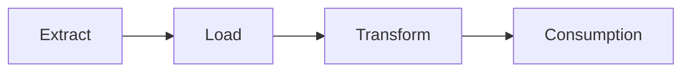
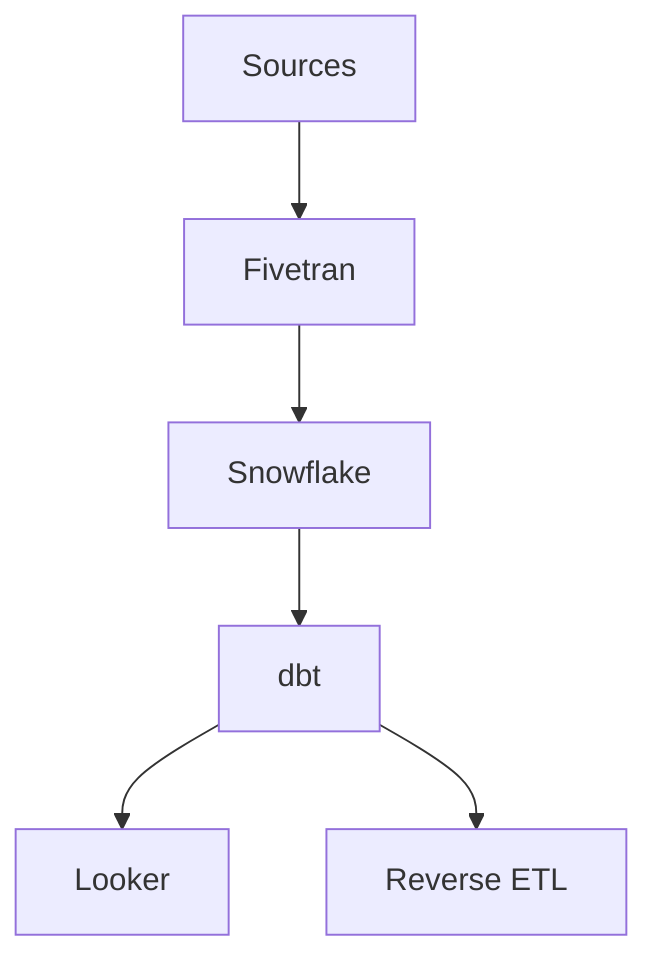
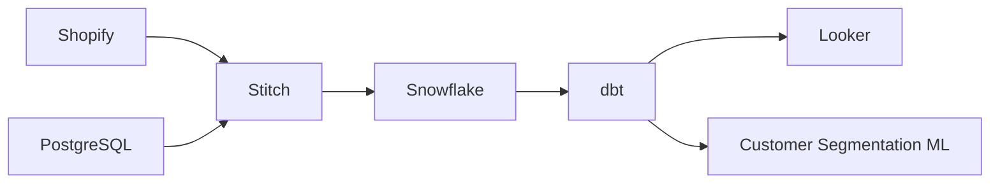
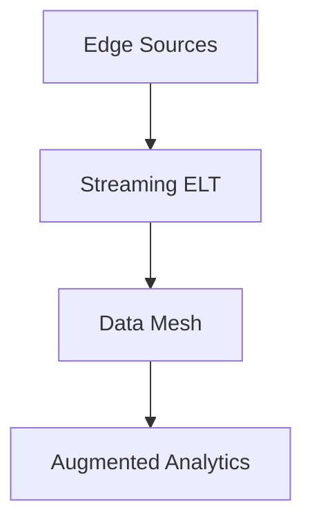

# 🏗️ ELT (Extract-Load-Transform) Comprehensive Guide: From Fundamentals to Real-World Implementation

## Table of Contents
1. [ELT Architecture Deep Dive](#1-elt-architecture-deep-dive)
2. [Key Components of Modern ELT](#2-key-components-of-modern-elt)
3. [Real-World ELT Patterns](#3-real-world-elt-patterns)
4. [Technology Stack Comparison](#4-technology-stack-comparison)
5. [Data Quality in ELT](#5-data-quality-in-elt)
6. [Performance Optimization](#6-performance-optimization)
7. [Case Study: E-Commerce Data Platform](#7-case-study-e-commerce-data-platform)
8. [Emerging Trends](#8-emerging-trends)
9. [Implementation Checklist](#9-implementation-checklist)

## 1. ELT Architecture Deep Dive

### 1.1 Core Philosophy


**Key Principles**:
- **Late Transformation**: Transform after loading to target
- **Leverage Target Compute**: Use warehouse processing power
- **Schema-on-Read**: Flexible data ingestion

### 1.2 Comparison with ETL
| Aspect              | ETL                     | ELT                     |
|---------------------|-------------------------|-------------------------|
| Transformation Time | Before loading          | After loading           |
| Hardware Needs      | Dedicated servers       | Cloud warehouse power   |
| Schema Requirements | Rigid upfront           | Flexible                |
| Best For            | Structured data         | Structured/semi-structured |

---

## 2. Key Components of Modern ELT

### 2.1 Extraction Layer
**Tools**:
- **Batch**: Fivetran, Airbyte, Stitch
- **Streaming**: Debezium, Kafka Connect

**Pattern**:
```python
# Sample extraction config (Airbyte)
source:
  type: "postgres"
  config:
    host: "prod-db.company.com"
    database: "orders"
    username: "${DB_USER}"
    password: "${DB_PASSWORD}"
    replication_method: "standard"
```

### 2.2 Loading Layer
**Strategies**:
- **Full Refresh**: Overwrite entire tables
- **Incremental**: Append new/changed data
- **CDC**: Real-time change propagation

**Example**:
```sql
-- Snowflake bulk load
COPY INTO raw_orders
FROM @s3_stage/orders/
FILE_FORMAT = (TYPE = 'PARQUET')
PATTERN = '.*2023-.*[.]parquet'
```

### 2.3 Transformation Layer
**dbt Example**:
```sql
-- models/core/orders.sql
WITH raw_orders AS (
    SELECT * FROM {{ source('ecommerce', 'raw_orders') }}
)

SELECT
    order_id,
    customer_id,
    amount,
    status,
    DATE_TRUNC('day', created_at) AS order_date
FROM raw_orders
WHERE status NOT IN ('cancelled')
```

---

## 3. Real-World ELT Patterns

### 3.1 Modern Data Stack


### 3.2 Enterprise ELT Pipeline
1. **Data Extraction**:
   - SaaS APIs (Salesforce, Marketo)
   - Database replication (PostgreSQL, MySQL)
   - File imports (CSV, JSON from S3)

2. **Raw Zone Loading**:
   - Preserve source schema
   - Add metadata columns (_loaded_at, _source)

3. **Transformations**:
   - Staging (type casting, cleaning)
   - Business logic (KPIs, aggregations)
   - Marts (department-specific models)

---

## 4. Technology Stack Comparison

### 4.1 Popular ELT Tools
| Tool          | Type         | Best For                  | Pricing Model      |
|---------------|--------------|---------------------------|--------------------|
| Fivetran      | Managed      | Enterprise connectors      | Volume-based       |
| Airbyte       | Open-source  | Custom connectors          | Free/Commercial    |
| Matillion     | Self-hosted  | Visual transformations     | Subscription       |
| dbt           | Transform    | SQL-based modeling        | Open-core          |

### 4.2 Warehouse Performance
```sql
-- BigQuery vs Snowflake benchmark
SELECT 
  warehouse,
  AVG(query_time) as avg_time,
  cost_per_query
FROM benchmark_results
GROUP BY warehouse, cost_per_query
ORDER BY avg_time;
```

---

## 5. Data Quality in ELT

### 5.1 Testing Framework
```yaml
# dbt test example
models:
  - name: orders
    tests:
      - not_null:
          column_name: order_id
      - relationships:
          to: ref('customers')
          field: customer_id
      - accepted_values:
          column_name: status
          values: ['pending', 'shipped', 'completed']
```

### 5.2 Monitoring Dashboard
| Metric               | Threshold    | Alert Channel       |
|----------------------|--------------|---------------------|
| Freshness            | <24h delay   | Slack #data-alerts  |
| Row Count Variance   | ±15% change  | PagerDuty           |
| Null Rate            | <5% columns  | Email               |

---

## 6. Performance Optimization

### 6.1 Materialization Strategies
```sql
-- dbt config
{{
  config(
    materialized='incremental',
    unique_key='order_id',
    incremental_strategy='merge'
  )
}}
```

### 6.2 Partitioning Example
```sql
-- BigQuery partitioned table
CREATE TABLE fact_orders
PARTITION BY DATE(order_date)
CLUSTER BY customer_id
AS SELECT * FROM raw_orders;
```

---

## 7. Case Study: E-Commerce Data Platform

### 7.1 Architecture


### 7.2 Key Metrics Impact
| KPI               | Before ELT  | After ELT   |
|-------------------|-------------|-------------|
| Data Freshness    | 48h         | 1h          |
| Transformation Cost | $12k/mo   | $4k/mo      |
| Analytics Speed   | 15min/query | <30s/query  |

---

## 8. Emerging Trends

### 8.1 ELT Evolution
- **Reverse ETL**: Operational analytics (Hightouch, Census)
- **ELT for ML**: Feature stores (Tecton)
- **Data Contracts**: Schema enforcement

### 8.2 Future Architecture


---

## 9. Implementation Checklist

### 9.1 Project Setup
1. [ ] Identify all data sources
2. [ ] Select ELT tools (extraction/transformation)
3. [ ] Provision target warehouse

### 9.2 Pipeline Development
1. [ ] Build raw ingestion layer
2. [ ] Implement staging transformations
3. [ ] Develop business marts

### 9.3 Productionization
1. [ ] Set up orchestration (Airflow, Dagster)
2. [ ] Configure monitoring
3. [ ] Document data lineage

```markdown
[📚 Recommended Resources]
- "The Data Warehouse Toolkit" - Ralph Kimball
- dbt Labs Documentation
- Modern Data Stack Podcast
```