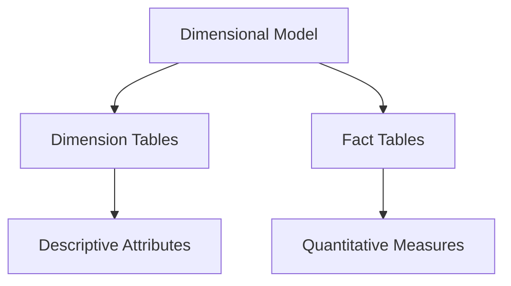
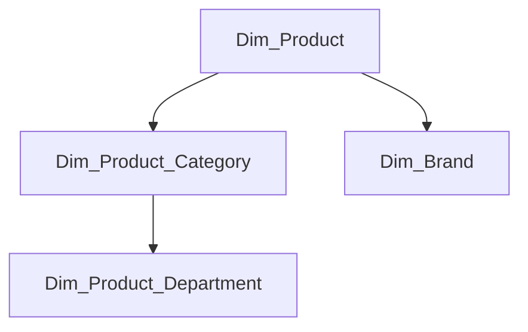
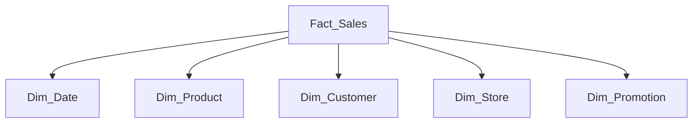
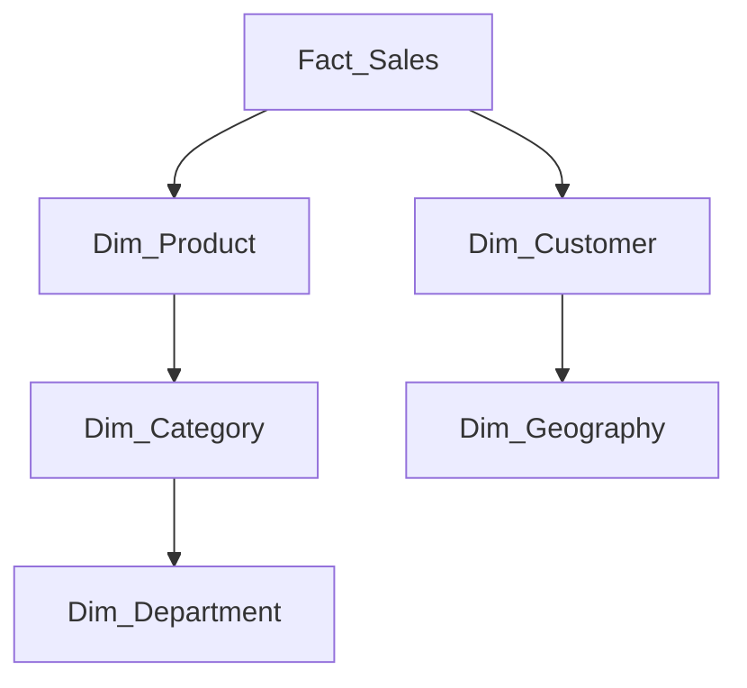
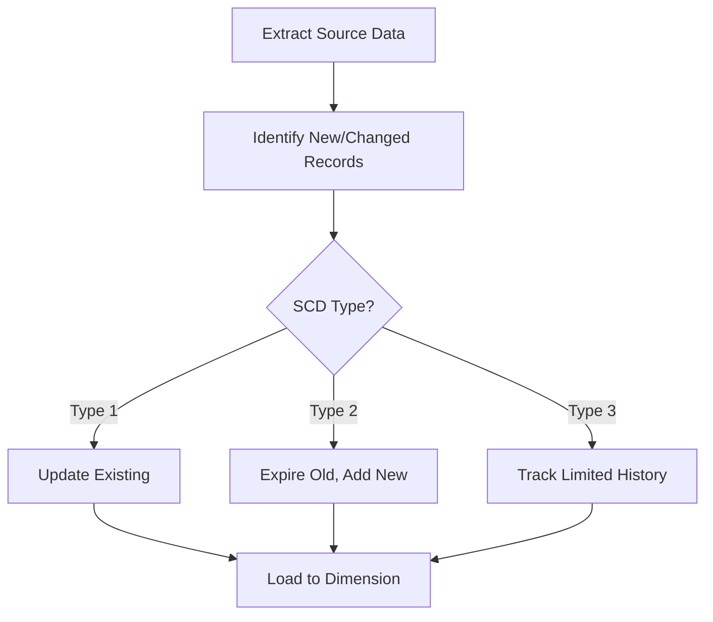
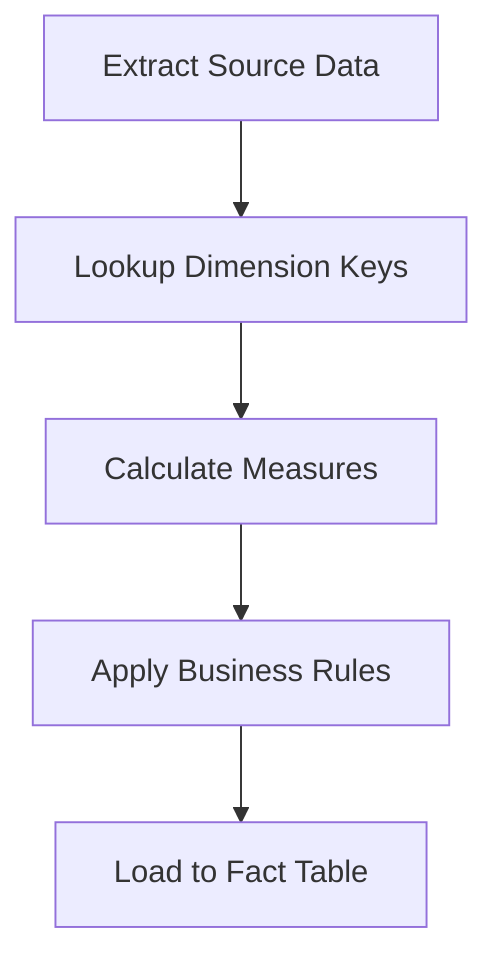
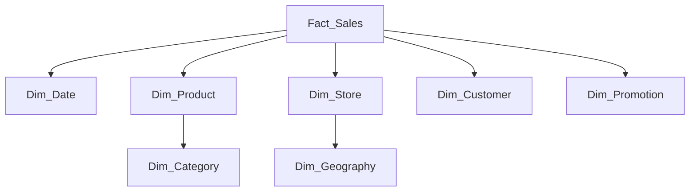
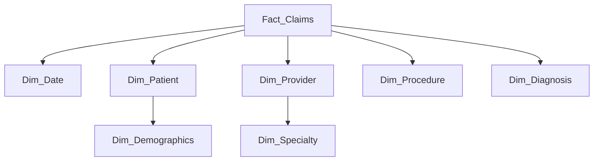

# Comprehensive Guide to Dimensional Modeling for Data Engineers

## Table of Contents
1. [Fundamental Concepts](#fundamental-concepts)
2. [Dimension Tables Deep Dive](#dimension-tables-deep-dive)
3. [Fact Tables Deep Dive](#fact-tables-deep-dive)
4. [Advanced Dimension Techniques](#advanced-dimension-techniques)
5. [Fact Table Variations](#fact-table-variations)
6. [Implementation Patterns](#implementation-patterns)
7. [ETL Strategies](#etl-strategies)
8. [Optimization Techniques](#optimization-techniques)
9. [Real-World Examples](#real-world-examples)
10. [Best Practices](#best-practices)

## Fundamental Concepts

### Dimensional Modeling Basics



### Key Characteristics

| Component | Purpose | Data Type | Example |
|-----------|---------|-----------|---------|
| **Dimension** | Business context | Text, IDs, Dates | Customer, Product, Date |
| **Fact** | Business measurements | Numeric, Decimals | Sales Amount, Quantity |
| **Relationship** | Connects facts to dimensions | Foreign Keys | product_key in fact_sales |

## Dimension Tables Deep Dive

### Structure of a Dimension Table

```sql
CREATE TABLE dim_customer (
    -- Surrogate Key
    customer_key INT IDENTITY(1,1) PRIMARY KEY,
    
    -- Natural Key
    customer_id VARCHAR(20) NOT NULL,
    
    -- Descriptive Attributes
    customer_name VARCHAR(100),
    email VARCHAR(100),
    phone VARCHAR(20),
    address VARCHAR(200),
    city VARCHAR(50),
    
    -- Hierarchy Attributes
    region VARCHAR(50),
    country VARCHAR(50),
    
    -- SCD Tracking
    effective_date DATE NOT NULL,
    expiry_date DATE,
    current_flag BOOLEAN NOT NULL,
    
    -- Metadata
    source_system VARCHAR(20),
    load_timestamp TIMESTAMP DEFAULT CURRENT_TIMESTAMP,
    
    -- Indexes
    CONSTRAINT uk_customer_id UNIQUE (customer_id, effective_date)
);
```

### Types of Dimensions

1. **Conformed Dimensions**
   - Shared across multiple fact tables
   - Ensures consistent reporting

2. **Junk Dimensions**
   - Combine low-cardinality flags/attributes
   ```sql
   CREATE TABLE dim_order_flags (
       flag_key INT PRIMARY KEY,
       is_express BOOLEAN,
       is_gift BOOLEAN,
       is_recurring BOOLEAN
   );
   ```

3. **Role-Playing Dimensions**
   - Single physical table, multiple logical roles
   ```sql
   SELECT 
       o.order_date,
       s.ship_date,
       d1.day_name AS order_day,
       d2.day_name AS ship_day
   FROM fact_orders o
   JOIN dim_date d1 ON o.order_date_key = d1.date_key
   JOIN dim_date d2 ON o.ship_date_key = d2.date_key
   ```

4. **Slowly Changing Dimensions (SCD)**
   - Type 1: Overwrite
   - Type 2: Add new version (most common)
   - Type 3: Keep limited history

## Fact Tables Deep Dive

### Structure of a Fact Table

```sql
CREATE TABLE fact_sales (
    -- Surrogate Keys
    sale_key BIGINT IDENTITY(1,1) PRIMARY KEY,
    
    -- Foreign Keys
    date_key INT NOT NULL REFERENCES dim_date(date_key),
    product_key INT NOT NULL REFERENCES dim_product(product_key),
    customer_key INT REFERENCES dim_customer(customer_key),
    store_key INT REFERENCES dim_store(store_key),
    
    -- Degenerate Dimension
    transaction_id VARCHAR(20) NOT NULL,
    
    -- Measures
    quantity SMALLINT NOT NULL,
    unit_price DECIMAL(10,2) NOT NULL,
    sales_amount DECIMAL(12,2) NOT NULL,
    discount_amount DECIMAL(10,2),
    tax_amount DECIMAL(10,2),
    
    -- Metadata
    source_system VARCHAR(20),
    load_timestamp TIMESTAMP DEFAULT CURRENT_TIMESTAMP,
    
    -- Indexes
    INDEX idx_fact_sales_date (date_key),
    INDEX idx_fact_sales_product (product_key)
);
```

### Fact Table Granularity

| Granularity Level | Example | Typical Use Case |
|-------------------|---------|------------------|
| Transaction | Line item in sales receipt | Operational reporting |
| Periodic Snapshot | Daily account balance | Trend analysis |
| Accumulating Snapshot | Order fulfillment pipeline | Process monitoring |

## Advanced Dimension Techniques

### Hierarchies and Snowflaking



**Implementation Choice:**
- **Star Schema:** Denormalize all hierarchy levels
- **Snowflake:** Normalize into separate tables

### Date Dimension Specialization

```sql
CREATE TABLE dim_date (
    date_key INT PRIMARY KEY,
    date DATE NOT NULL,
    day_of_week TINYINT NOT NULL, -- 1=Sunday
    day_name VARCHAR(10) NOT NULL,
    month TINYINT NOT NULL,
    month_name VARCHAR(10) NOT NULL,
    quarter TINYINT NOT NULL,
    year SMALLINT NOT NULL,
    is_weekend BOOLEAN NOT NULL,
    is_holiday BOOLEAN NOT NULL,
    fiscal_year SMALLINT NOT NULL,
    fiscal_quarter TINYINT NOT NULL,
    week_of_year TINYINT NOT NULL,
    day_of_year SMALLINT NOT NULL
);
```

### SCD Type 2 Implementation

```python
# PySpark SCD Type 2 Implementation
from pyspark.sql import functions as F

# Load current dimension and updates
current_dim = spark.table("dim_customer")
updates = spark.table("stg_customer_updates")

# Detect changes
changes = updates.join(current_dim, "customer_id", "left") \
    .filter((current_dim.current_flag == True) & 
           ((updates.customer_name != current_dim.customer_name) |
            (updates.email != current_dim.email)))

# Expire old records
expired_records = changes.select(
    current_dim["*"],
    F.current_date().alias("expiry_date"),
    F.lit(False).alias("current_flag")
)

# Create new versions
new_versions = changes.select(
    F.monotonically_increasing_id().alias("customer_key"),
    updates["*"],
    F.current_date().alias("effective_date"),
    F.lit(None).alias("expiry_date"),
    F.lit(True).alias("current_flag")
)

# Union and write
final_dim = current_dim.filter("current_flag = true") \
    .unionByName(expired_records) \
    .unionByName(new_versions)
```

## Fact Table Variations

### Transaction Fact Tables

```sql
CREATE TABLE fact_orders (
    order_key BIGINT PRIMARY KEY,
    order_date_key INT REFERENCES dim_date(date_key),
    customer_key INT REFERENCES dim_customer(customer_key),
    product_key INT REFERENCES dim_product(product_key),
    quantity INT,
    unit_price DECIMAL(10,2),
    line_amount DECIMAL(12,2),
    order_number VARCHAR(20) -- Degenerate dimension
);
```

### Periodic Snapshot Fact Tables

```sql
CREATE TABLE fact_account_balance (
    snapshot_key BIGINT PRIMARY KEY,
    account_key INT REFERENCES dim_account(account_key),
    date_key INT REFERENCES dim_date(date_key),
    balance_amount DECIMAL(15,2),
    credit_limit DECIMAL(15,2),
    days_overdue INT
);
```

### Accumulating Snapshot Fact Tables

```sql
CREATE TABLE fact_order_fulfillment (
    order_key BIGINT PRIMARY KEY,
    order_date_key INT REFERENCES dim_date(date_key),
    ship_date_key INT REFERENCES dim_date(date_key),
    delivery_date_key INT REFERENCES dim_date(date_key),
    return_date_key INT REFERENCES dim_date(date_key),
    customer_key INT REFERENCES dim_customer(customer_key),
    days_to_ship INT,
    days_to_deliver INT,
    return_status VARCHAR(20)
);
```

## Implementation Patterns

### Star Schema Implementation



**Advantages:**
- Simplified queries
- Better query performance
- Easier to understand

### Snowflake Schema Implementation



**Advantages:**
- Storage efficiency
- Flexible hierarchies
- Normalized structure

## ETL Strategies

### Dimension Loading Process



### Fact Table Loading Process



## Optimization Techniques

### Indexing Strategies

```sql
-- Dimension Tables
CREATE INDEX idx_dim_product_nk ON dim_product(product_id);
CREATE INDEX idx_dim_customer_email ON dim_customer(email);

-- Fact Tables
CREATE INDEX idx_fact_sales_date ON fact_sales(date_key);
CREATE INDEX idx_fact_sales_product ON fact_sales(product_key);
CREATE INDEX idx_fact_sales_customer ON fact_sales(customer_key);
```

### Partitioning Large Fact Tables

```sql
-- PostgreSQL Partitioning Example
CREATE TABLE fact_sales (
    sale_key BIGSERIAL,
    date_key INT NOT NULL,
    product_key INT NOT NULL,
    ...
) PARTITION BY RANGE (date_key);

-- Create monthly partitions
CREATE TABLE fact_sales_202301 PARTITION OF fact_sales
    FOR VALUES FROM (20230101) TO (20230201);
```

### Materialized Views for Aggregates

```sql
CREATE MATERIALIZED VIEW mv_monthly_sales
REFRESH COMPLETE ON DEMAND
AS
SELECT 
    d.year,
    d.month,
    p.category,
    SUM(f.sales_amount) AS total_sales,
    COUNT(*) AS transaction_count
FROM fact_sales f
JOIN dim_date d ON f.date_key = d.date_key
JOIN dim_product p ON f.product_key = p.product_key
GROUP BY d.year, d.month, p.category;
```

## Real-World Examples

### Retail Sales Schema



**Fact Table Measures:**
- Sales quantity
- Unit price
- Discount amount
- Tax amount
- Net amount

### Healthcare Claims Schema



**Fact Table Measures:**
- Claim amount
- Paid amount
- Procedure count
- Days in hospital

## Best Practices

### Dimension Table Best Practices

1. **Use Surrogate Keys** - System-generated integers independent of business keys
2. **Maintain Natural Keys** - Preserve business identifiers for traceability
3. **Implement SCD Type 2** - Track historical changes where needed
4. **Include Comprehensive Metadata** - Source system, load timestamps
5. **Optimize for Read Performance** - Denormalize where appropriate

### Fact Table Best Practices

1. **Design for Grain** - Clearly define what each row represents
2. **Use Foreign Keys** - Properly relate to dimensions
3. **Handle NULLs Carefully** - Use zeros for additive measures
4. **Consider Partitioning** - By date for large fact tables
5. **Optimize Data Types** - Use smallest practical numeric types

### ETL Best Practices

1. **Dimension First** - Load dimensions before facts
2. **Key Lookup Optimization** - Use efficient dimension key lookups
3. **Incremental Loading** - Where possible for performance
4. **Data Quality Checks** - Validate before loading
5. **Parallel Processing** - For large fact table loads

### Query Optimization Tips

1. **Star Join Optimization** - Enable in query engine settings
2. **Aggregate Awareness** - Use materialized views when possible
3. **Partition Pruning** - Filter on partitioned columns
4. **Columnar Storage** - For analytical query patterns
5. **Statistics Maintenance** - Keep statistics up-to-date

This comprehensive guide provides data engineers with complete knowledge to design, implement, and optimize dimensional models using fact and dimension tables. The patterns can be adapted to any data warehouse or data lake environment.