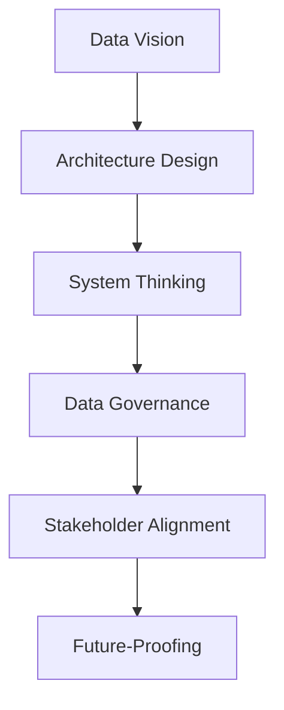
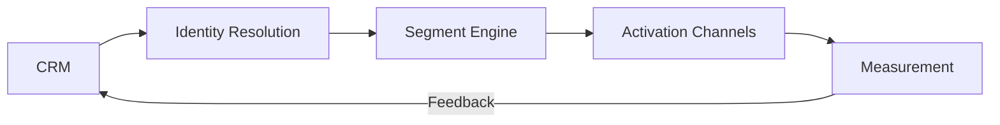
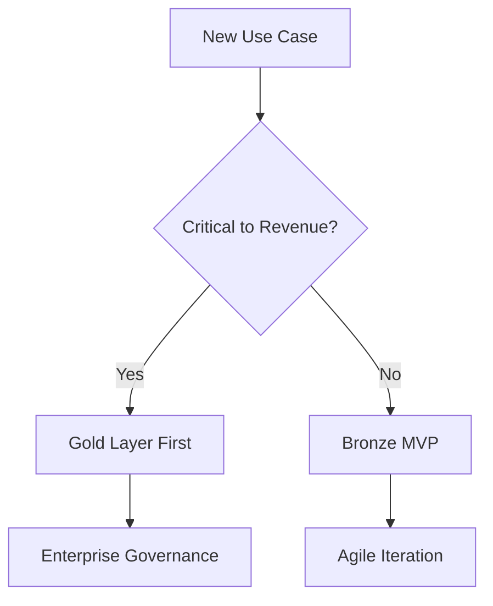

# Macro Skills for Data Engineers: Strategic Principles and Practices

## The Data Engineer's Strategic Framework

As a data engineer, your macro skills determine how effectively you can architect systems that deliver business value. These are the high-level competencies that separate tactical implementers from strategic data leaders.

## Core Macro Skills Framework



### 1. Business-Driven Data Vision

**Principle:** "Data exists to serve business outcomes"

**Key Practices:**
- Translate executive KPIs into data requirements
- Map data assets to revenue/cost centers
- Identify "data leverage points" that create disproportionate value

**Example:** For an e-commerce company, recognizing that unifying product catalog data with customer behavior data could enable:
- 15% improvement in recommendation accuracy
- 20% reduction in inventory costs
- New subscription revenue models

### 2. Holistic Architecture Design

**Principle:** "Design systems that evolve with the business"

**Pattern Recognition:**
- Spot architectural anti-patterns before implementation
- Balance immediate needs with long-term flexibility
- Design for 10x scale, not just 2x

**Decision Framework:**

| Requirement | Medallion | Data Vault | Lakehouse |
|-------------|-----------|------------|-----------|
| Agile analytics | ✓✓✓ | ✓ | ✓✓✓ |
| Regulatory compliance | ✓ | ✓✓✓ | ✓✓ |
| Real-time needs | ✓✓ | ✓ | ✓✓✓ |
| Legacy integration | ✓✓ | ✓✓✓ | ✓ |

**Case Study:** Designed a hybrid architecture for a financial client:
- Data Vault for core banking transactions (regulatory requirement)
- Medallion layers for customer analytics (agility needed)
- Real-time lakehouse for fraud detection

### 3. Systems Thinking

**Principle:** "Data pipelines are living ecosystems"

**Key Perspectives:**
- Understand second-order effects of design decisions
- Map data dependencies across the organization
- Anticipate failure modes at scale

**Example:** Implementing a new customer data platform required:

Recognized the need for:
- Circuit breakers when match rates drop
- Feedback loops to improve matching
- Graceful degradation for marketing systems

### 4. Governance by Design

**Principle:** "Quality and compliance are architecture features"

**Strategic Approach:**
- Build metadata collection into pipelines
- Implement privacy at the storage layer
- Design for auditability from day one

**Implementation Pattern:**
```python
# PII handling in Silver layer
def transform_customer_data(df):
    return (df
        .withColumn("email_hash", sha2(col("email"), 256))  # Pseudonymization
        .withColumn("processing_tier", 
            when(col("consent_status") == "FULL", 1).otherwise(2))  # GDPR
        .drop("raw_ssn")  # Never propagate sensitive data
    )
```

### 5. Stakeholder Orchestration

**Principle:** "Data engineers are cross-functional conductors"

**Strategic Practices:**
- Create shared data dictionaries with business terms
- Develop "data contract" interfaces between teams
- Run architecture review councils

**Artifact Example: Data Product Canvas**
```
1. Business Owner: Marketing
2. Key Metrics: Customer LTV, Churn Risk
3. Source Systems: CRM, Billing, Web Analytics
4. Service Level: 99.9% availability <24h latency
5. Consumers: Analytics, Campaign Tools
6. Evolution Roadmap: Q3 - Add survey data
```

### 6. Future-Proofing

**Principle:** "Build for unknown future requirements"

**Key Strategies:**
- Implement abstraction layers (e.g., data virtualization)
- Standardize on open formats (Parquet, Delta)
- Design for incremental evolution

**Example: Metadata-Driven Pipelines**
```sql
-- Dynamic pipeline configuration
SELECT 
    source_name,
    landing_zone_path,
    primary_keys,
    quality_rules
FROM pipeline_registry
WHERE domain = 'finance';
```

## Strategic Decision Patterns

### The Data Engineer's Decision Tree



### Architecture Tradeoff Framework

| Dimension | Short-Term Win | Sustainable Approach |
|-----------|----------------|----------------------|
| Storage   | Single Region  | Multi-Cloud Strategy |
| Processing | Fixed Clusters | Auto-Scaling |
| Formats   | Vendor-Specific | Open Standards |
| Metadata  | Documentation  | Embedded Lineage |

## Leadership-Level Artifacts

### 1. Data Maturity Assessment

```
◻ Level 1: Fragmented Silos  
◻ Level 2: Centralized Warehouse  
◻ Level 3: Domain-Owned Products  
◻ Level 4: AI-Ready Ecosystem
```

### 2. ROI Calculation Template

```
Investment: $500k in Data Lake
Benefits:
- $2M/year reduced ETL maintenance
- $5M/year new analytics capabilities
Payback Period: 6 months
```

### 3. Risk Heat Map

| Risk | Probability | Impact | Mitigation |
|------|------------|--------|------------|
| Vendor Lock-in | Medium | High | Open formats |
| Data Breach | Low | Critical | Encryption at rest |
| Schema Drift | High | Medium | Contract testing |

## Developing Your Macro Skills

1. **Study Business Fundamentals**: Take courses in corporate finance and strategy
2. **Practice Architecture Reviews**: Analyze existing systems and propose improvements
3. **Build Decision Frameworks**: Create templates for common tradeoffs
4. **Engage Beyond Tech**: Participate in business planning sessions

Remember: The most effective data engineers don't just build pipelines—they design systems that create competitive advantage through data. Your macro skills determine whether you're seen as a cost center or a strategic enabler.