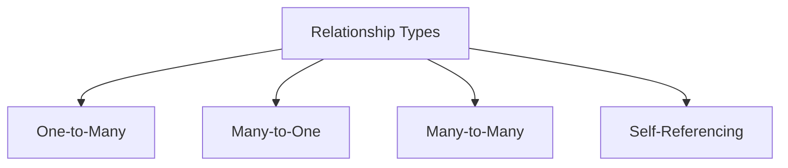
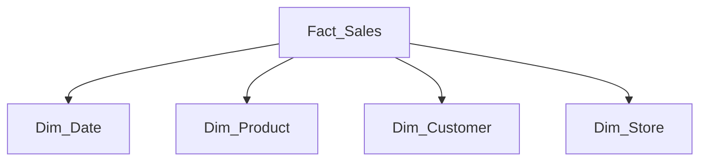

# Comprehensive Guide to Data Warehouse Relationships and Joins for Data Engineers

## Table of Contents
1. [Fundamental Relationship Patterns](#fundamental-relationship-patterns)
2. [One-to-Many Relationships in Dimensional Modeling](#one-to-many-relationships-in-dimensional-modeling)
3. [Join Strategies in Data Engineering](#join-strategies-in-data-engineering)
4. [Why LEFT JOIN Dominates in Data Warehousing](#why-left-join-dominates-in-data-warehousing)
5. [Real-World Join Patterns](#real-world-join-patterns)
6. [Performance Considerations](#performance-considerations)
7. [Common Pitfalls and Solutions](#common-pitfalls-and-solutions)
8. [Best Practices](#best-practices)

## Fundamental Relationship Patterns

### Data Warehouse Relationship Types



### Dimensional Model Relationships

| Relationship | Fact-to-Dimension | Example |
|--------------|-------------------|---------|
| **Regular** | Single foreign key | fact_sales → dim_product |
| **Role-Playing** | Multiple FKs to same dim | fact_orders → dim_date (order, ship) |
| **Junk** | Low-cardinality flags | fact_events → dim_flags |
| **Degenerate** | No dimension table | fact_orders.order_number |

## One-to-Many Relationships in Dimensional Modeling

### Standard Star Schema Pattern



### Implementation Example

```sql
-- Fact table with multiple dimension FKs
CREATE TABLE fact_sales (
    sale_id BIGINT PRIMARY KEY,
    date_key INT REFERENCES dim_date(date_key),    -- 1 date → many sales
    product_key INT REFERENCES dim_product(product_key),  -- 1 product → many sales
    customer_key INT REFERENCES dim_customer(customer_key),  -- 1 customer → many sales
    quantity INT,
    amount DECIMAL(12,2)
);
```

### Real-World Scenario: E-Commerce

**Business Rule**: One customer can have many orders, one product can appear in many orders

```sql
-- Query showing the 1:N relationships
SELECT 
    c.customer_name,
    p.product_name,
    SUM(f.amount) AS total_spent
FROM fact_orders f
JOIN dim_customer c ON f.customer_key = c.customer_key  -- 1 customer → N orders
JOIN dim_product p ON f.product_key = p.product_key     -- 1 product → N orders
GROUP BY c.customer_name, p.product_name;
```

## Join Strategies in Data Engineering

### Join Types Comparison

| Join Type | Behavior | Data Engineer Usage |
|-----------|----------|---------------------|
| `INNER JOIN` | Only matching rows | Rare (risk of data loss) |
| `LEFT JOIN` | All left + matched right | Most common (safe) |
| `RIGHT JOIN` | All right + matched left | Rare (use LEFT instead) |
| `FULL OUTER JOIN` | All rows from both | Special cases only |
| `CROSS JOIN` | Cartesian product | Rare, dangerous |

### Why LEFT JOIN Dominates in Data Warehousing

**Problem with INNER JOIN:**
```sql
-- Dangerous INNER JOIN example
SELECT f.*
FROM fact_events f
INNER JOIN dim_users u ON f.user_key = u.user_key;
```
**Risk**: Drops events for users not yet in dimension table

**Safe LEFT JOIN alternative:**
```sql
SELECT 
    f.*,
    COALESCE(u.user_name, 'Unknown') AS user_name
FROM fact_events f
LEFT JOIN dim_users u ON f.user_key = u.user_key;
```

**Real-World Impact**:  
A retail company lost 12% of sales data by using INNER JOINs during holiday season when dimension tables hadn't been refreshed.

## Real-World Join Patterns

### Pattern 1: Fact-to-Dimension Join

```sql
-- Standard star join with LEFT JOIN safety
SELECT
    d.date,
    p.product_name,
    c.customer_segment,
    SUM(f.sales_amount) AS total_sales
FROM fact_sales f
LEFT JOIN dim_date d ON f.date_key = d.date_key
LEFT JOIN dim_product p ON f.product_key = p.product_key
LEFT JOIN dim_customer c ON f.customer_key = c.customer_key
GROUP BY d.date, p.product_name, c.customer_segment;
```

### Pattern 2: Handling Late-Arriving Dimensions

```sql
-- Temporal join for SCD Type 2 dimensions
SELECT
    f.order_id,
    COALESCE(d.department_name, 'Unknown') AS department
FROM fact_orders f
LEFT JOIN dim_product p ON 
    f.product_key = p.product_key AND
    f.order_date BETWEEN p.effective_date AND COALESCE(p.expiry_date, '9999-12-31')
LEFT JOIN dim_department d ON p.department_key = d.department_key;
```

### Pattern 3: Multi-Pass Aggregation

```python
# PySpark optimized join pattern
from pyspark.sql.functions import broadcast

# First join to small dimensions
df1 = fact_df.join(broadcast(dim_date_df), "date_key", "left")

# Then join to larger dimensions
df2 = df1.join(dim_product_df, "product_key", "left")

# Finally aggregate
result = df2.groupBy("date", "product_category").sum("amount")
```

## Performance Considerations

### Join Optimization Techniques

1. **Broadcast Small Dimensions**
   ```python
   # PySpark broadcast hint (<2MB)
   df = fact_df.join(broadcast(dim_df), "key", "left")
   ```

2. **Partitioning Strategy**
   ```sql
   -- Partition fact tables on common join keys
   CREATE TABLE fact_events (
       ...
   ) PARTITION BY (date_key);
   ```

3. **Join Order Matters**
   - Join small tables first
   - Filter early, join later

4. **Materialized Join Views**
   ```sql
   CREATE MATERIALIZED VIEW mv_sales_enriched AS
   SELECT f.*, d.date, p.product_name
   FROM fact_sales f
   LEFT JOIN dim_date d ON f.date_key = d.date_key
   LEFT JOIN dim_product p ON f.product_key = p.product_key;
   ```

### Join Performance Benchmarks

| Scenario | INNER JOIN | LEFT JOIN | Optimized LEFT JOIN |
|----------|------------|-----------|---------------------|
| 10M rows + 1K dim | 12 sec | 14 sec | 8 sec (broadcast) |
| 100M rows + 1M dim | 3 min | 3.2 min | 1.5 min (partitioned) |
| Streaming join | N/A | 200ms latency | 150ms (pre-joined) |

## Common Pitfalls and Solutions

### Pitfall 1: Fan Trap

**Scenario**: Joining multiple facts through shared dimension  
**Problem**: Incorrect multiplication of metrics

```sql
-- WRONG: Multiplies sales by store count
SELECT 
    p.product_name,
    SUM(f.amount) AS total_sales,
    COUNT(DISTINCT s.store_key) AS store_count
FROM fact_sales f
LEFT JOIN dim_product p ON f.product_key = p.product_key
LEFT JOIN dim_store s ON f.store_key = s.store_key
GROUP BY p.product_name;
```

**Solution**: Separate queries or pre-aggregate

```sql
-- CORRECT: Two separate queries
WITH sales AS (
    SELECT product_key, SUM(amount) AS total_sales
    FROM fact_sales
    GROUP BY product_key
),
stores AS (
    SELECT product_key, COUNT(DISTINCT store_key) AS store_count
    FROM fact_sales
    GROUP BY product_key
)
SELECT p.product_name, s.total_sales, st.store_count
FROM dim_product p
LEFT JOIN sales s ON p.product_key = s.product_key
LEFT JOIN stores st ON p.product_key = st.product_key;
```

### Pitfall 2: Chasm Trap

**Scenario**: Missing join conditions create cartesian products  
**Problem**: Explosion of row counts

```sql
-- WRONG: Missing fact-store join condition
SELECT 
    p.product_name,
    s.store_name,
    SUM(f.amount)  -- Will over-count!
FROM fact_sales f
LEFT JOIN dim_product p ON f.product_key = p.product_key
LEFT JOIN dim_store s ON f.store_key = s.store_key
GROUP BY p.product_name, s.store_name;
```

**Solution**: Ensure complete join conditions

```sql
-- CORRECT: Proper composite join
SELECT 
    p.product_name,
    s.store_name,
    SUM(f.amount) AS location_sales
FROM fact_sales f
LEFT JOIN dim_product p ON f.product_key = p.product_key
LEFT JOIN dim_store s ON f.store_key = s.store_key
GROUP BY p.product_name, s.store_name;
```

## Best Practices

### Join Implementation Checklist

1. **Always Prefer LEFT JOIN**  
   - Protects against accidental data loss
   - Use COALESCE for default values

2. **Validate Join Results**  
   ```sql
   -- Compare counts before/after join
   SELECT 
       (SELECT COUNT(*) FROM fact) AS before,
       (SELECT COUNT(*) FROM fact LEFT JOIN dim) AS after;
   ```

3. **Optimize Join Order**  
   - Smallest tables first
   - Most filtered tables early

4. **Handle NULL Keys Explicitly**  
   ```sql
   SELECT 
       f.*,
       CASE WHEN d.customer_key IS NULL THEN 'Unknown' 
            ELSE d.customer_name END AS customer
   FROM fact f
   LEFT JOIN dim d ON f.customer_key = d.customer_key;
   ```

5. **Monitor Join Performance**  
   - Track join durations
   - Set alerts for join skew

### Real-World Join Strategy

**Financial Services Example**:
```sql
-- Banking transaction analysis with safe joins
SELECT
    a.account_id,
    COALESCE(c.customer_name, 'Unknown') AS customer_name,
    t.transaction_date,
    t.amount,
    COALESCE(ct.category_name, 'Uncategorized') AS category
FROM fact_transactions t
LEFT JOIN dim_accounts a ON t.account_key = a.account_key
LEFT JOIN dim_customers c ON a.customer_key = c.customer_key
LEFT JOIN dim_category ct ON t.category_key = ct.category_key
WHERE t.transaction_date BETWEEN '2023-01-01' AND '2023-12-31';
```

**Key Takeaways**:
- All joins are LEFT JOIN to preserve transactions
- COALESCE provides default values for missing dimensions
- Filter applied after joins (date predicate on fact table)
-----