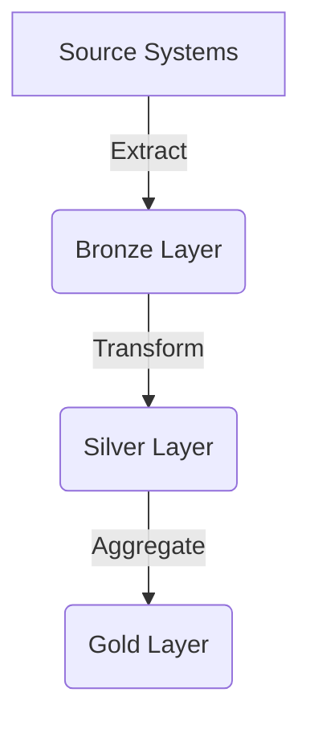

# Data Engineering Fundamentals

This document covers essential database concepts for Data Engineers, focusing on tables, views, materialized views, and related structures.

## Table of Contents
1. [Tables](#tables)
2. [Views](#views)
3. [Materialized Views](#materialized-views)
4. [Stored Procedures](#stored-procedures)
5. [Indexes](#indexes)
6. [Partitions](#partitions)
7. [ETL Processes](#etl-processes)

## Tables

### Basic Table Structure
```sql
CREATE TABLE schema_name.table_name (
    column1 datatype [constraints],
    column2 datatype [constraints],
    ...
    [table_constraints]
);
```

### Common Table Types
| Type | Description | Use Case |
|------|-------------|----------|
| Heap Table | Unordered data storage | Raw data ingestion |
| Clustered Table | Physically ordered by key | Frequently queried tables |
| Temporary Table | Session-scoped storage | Intermediate calculations |
| External Table | Metadata pointing to external files | Data lake integration |

### Example
```sql
CREATE TABLE bronze.customers (
    customer_id INT PRIMARY KEY,
    name VARCHAR(100) NOT NULL,
    email VARCHAR(255) UNIQUE,
    created_at TIMESTAMP DEFAULT CURRENT_TIMESTAMP,
    is_active BOOLEAN DEFAULT TRUE
);
```

## Views

### Standard View
```sql
CREATE VIEW silver.customer_summary AS
SELECT 
    customer_id,
    name,
    COUNT(order_id) AS total_orders,
    SUM(amount) AS lifetime_value
FROM bronze.customers
LEFT JOIN bronze.orders USING (customer_id)
GROUP BY customer_id, name;
```

### View Characteristics
| Feature | Description |
|---------|-------------|
| Virtual Table | Doesn't store physical data |
| Dynamic | Always reflects current base data |
| Security Layer | Can restrict column access |
| Query Simplification | Hides complex joins/filters |

## Materialized Views

### Creation Syntax
```sql
CREATE MATERIALIZED VIEW gold.customer_metrics
REFRESH COMPLETE ON DEMAND
AS
SELECT 
    customer_id,
    AVG(order_amount) AS avg_order_value,
    MAX(order_date) AS last_order_date
FROM silver.orders
GROUP BY customer_id;
```

### Refresh Strategies
| Strategy | Description | When to Use |
|----------|-------------|-------------|
| COMPLETE | Rebuilds entire view | After major data changes |
| FAST | Incremental refresh | Frequent small updates |
| ON COMMIT | Auto-refresh after DML | Real-time requirements |
| ON DEMAND | Manual refresh | Scheduled maintenance |

## Stored Procedures

### Basic Structure
```sql
CREATE OR ALTER PROCEDURE gold.refresh_materialized_views
AS
BEGIN
    BEGIN TRY
        EXEC sp_refreshview 'gold.customer_metrics';
        EXEC sp_refreshview 'gold.product_performance';
        PRINT 'Successfully refreshed materialized views';
    END TRY
    BEGIN CATCH
        PRINT 'Error: ' + ERROR_MESSAGE();
    END CATCH
END;
```

### Common Use Cases
- Data transformation pipelines
- Scheduled maintenance tasks
- Complex business logic encapsulation
- Data validation routines

## Indexes

### Index Types Comparison
| Type | Speed (Read) | Speed (Write) | Storage | Best For |
|------|-------------|--------------|---------|----------|
| B-tree | Fast | Medium | Medium | General purpose |
| Hash | Very Fast | Fast | Low | Equality searches |
| Bitmap | Slow | Very Slow | Low | Low-cardinality columns |
| Columnstore | Very Fast | Slow | High | Analytical queries |

### Creation Example
```sql
CREATE CLUSTERED INDEX idx_orders_date
ON silver.orders (order_date);

CREATE NONCLUSTERED INDEX idx_customer_email
ON bronze.customers (email)
INCLUDE (name, phone);
```

## Partitions

### Partitioning Strategies
```sql
-- Range partitioning example
CREATE TABLE fact.sales (
    sale_id INT,
    sale_date DATE,
    amount DECIMAL(10,2),
    region VARCHAR(50)
) PARTITION BY RANGE (sale_date) (
    PARTITION p_2022 VALUES LESS THAN ('2023-01-01'),
    PARTITION p_2023 VALUES LESS THAN ('2024-01-01'),
    PARTITION p_future VALUES LESS THAN (MAXVALUE)
);
```

### Partition Benefits
1. **Query Performance**: Scan only relevant partitions
2. **Maintenance**: Manage (backup/drop) partitions individually
3. **Storage**: Older partitions can use cheaper storage

## ETL Processes

### Common Patterns



### Key Components
1. **Bronze Layer**
   - Raw, unprocessed data
   - Preserve source fidelity
   - Append-only storage

2. **Silver Layer**
   - Cleaned and validated
   - Type conversions applied
   - Basic joins/denormalization

3. **Gold Layer**
   - Business-ready aggregates
   - Optimized for analytics
   - Materialized views/cubes

### Example ETL Pipeline
```sql
-- Bronze to Silver transformation
INSERT INTO silver.customers
SELECT 
    customer_id,
    TRIM(name) AS customer_name,
    LOWER(email) AS email,
    CASE WHEN status IN (1,'active') THEN TRUE ELSE FALSE END AS is_active,
    created_at
FROM bronze.raw_customers
WHERE customer_id IS NOT NULL;
```

## Best Practices

1. **Naming Conventions**
   - `snake_case` for tables/columns
   - Prefixes for views (`vw_`), procedures (`sp_`)
   - Environment suffixes (`_dev`, `_prod`)

2. **Documentation**
   - Column descriptions
   - Data lineage information
   - Refresh schedules

3. **Performance**
   - Partition large tables (>10M rows)
   - Index strategically (read vs write balance)
   - Monitor query plans regularly

4. **Change Management**
   - Version control for DDL scripts
   - Backward-compatible changes
   - Zero-downtime deployments